--- 
title: "Integrated Bioanalytics"
author: "Lucas Busta and members of the Busta lab"
date: "2022-10-13"
site: bookdown::bookdown_site
documentclass: krantz
bibliography: [book.bib, packages.bib]
# url: your book url like https://bookdown.org/yihui/bookdown
# cover-image: path to the social sharing image like images/cover.jpg
description: |
  Integrated Bioanalytics is a book describing how to perform chemical, phylogenetic, and genomic analyses.
biblio-style: apalike
csl: chicago-fullnote-bibliography.csl
output:
  bookdown::bs4_book:
    theme:
      primary: "#3860b6" #links  
      base_font: 
        google: 
          family: Lato
      heading_font:
        google:
          family: Montserrat
          wght: 600
      code_font:
        google: 
          family: Roboto Mono
      bg: "#fefefe" #backgrounds
      fg: "#000000" #fonts
    repo: 
      base: https://github.com/thebustalab/thebustalab.github.io/tree/master/integrated_bioanalytics
      branch: main
    includes:
      in_header: style/ga.html
    template: style/bs4_book.html
    css: style/style.css
---


# WELCOME {-}

<!-- start preface-->


Integrated Bioanalytics documents methods for analyzing chemical and sequence data in R as well as some basics of scientific writing. It is maintained by Lucas Busta and members of the Busta lab. To run the analyses described in this book you will need to run a source script that will set up your R environment with a variety of packages, custom functions, and data sets. If you don't have R, see "installation" under "Data Analysis In R" in the table of contents. Run the source script by pasting and executing the following in your R command line (RStudio recommended). If you are in the Busta Lab (or want access to full features), define an object `bustalab = TRUE` before running the source command. If you have trouble running the source script, please reach out to Lucas Busta at: bust0037@d.umn.edu. The source script: 


```r
source("https://thebustalab.github.io/phylochemistry/phylochemistry.R")
```

Features provided by the source script:

--Analysis and visualization tools--

* A GC-MS data analysis application with a MS reference library.
* A sequence alignment analysis application for trimming alignments.
* Hard-to-find color palettes (for example, a 25-member discrete color palette)

--Useful data--

* More than 12 chemical data sets for running practice analyses.
* A phylogeny for >30,000 plant species, including nearly 30,000 angiosperms, >500 gymnosperms, nearly 500 pteridophytes, and 100 bryophytes (https://thebustalab.github.io/data/plant_phylogeny.newick).
* A list of nearly 400,000 plant species as well as the families, orders, and phyla to which they belong (https://thebustalab.github.io/data/plant_species.csv).

<!-- end -->

# (PART) DATA ANALYSIS IN R

<!-- start overview -->

# overview {-}


In bioanalytical science, we separate, identify, and quantify matter - be it DNA, RNA, proteins, small molecules, or even atoms. To connect our data with the world around us and answer scientific questions, multiple chemical entities must be separated, quantified, and identified. As our ability to collect analytical data expands, so must our ability to effectively analyze that data - whether it’s 10 data points or 10,000. In this chapter, we will explore, critique, and practice methods of handling and visualizing the data generated in large analytical projects. We'll also look at how to answer common quesions we may have about our data: "Which of my samples are most closely related?", "Which analytes are driving differences among my samples?", "Do my samples fall into definable clusters?", "Are any of my variables related?", and "Are any of these distributions different?".

<!-- end -->

<!-- start installation -->

# installation {-}


## R {-}

R is the computing language we will use to run our analyses and produce high quality plots. If you already have R installed (you will need at least version 4.1.1), you can go straight to installing RStudio. If not, follow these steps to install R:

1. Go to https://cran.r-project.org/

2. Click on "Download R for \<your operating system\>" (see footnote), depending on your operating system you will select "Download R for Linux", "Download R for (Mac) OS X", or "Download R for Windows".

We will use \<this notation\> quite a bit. It indicates a place where you should insert information, data, or something similar that corresponds to your particular situation. In this example it means insert "your operating system", i.e. Linux, (Mac) OS X, or Windows.

3. For Mac: download the .pkg file for the latest release. For PC: click "install R for the first time", then click "Download R \<version\> for Windows".

4. After the executable finishes downloading (in Windows, it is a file with .exe extension; for Mac, it is a .dmg file or a .dmg inside a .pkg file), open the file as an administrator, and follow the installation instructions. R should install without any problems. You can click OK for all of the windows that pop-up during installation, and choose a "regular" installation (if given the choice). 

If you have trouble installing R please google "Install R Mac" or "Install R PC" and follow one the many video tutorials out there. If you have tried this and are still having trouble, please contact me.

## RStudio {-}

Once we install R, we can install RStudio, which is essentially a convenient way of interacting with R. Some people do not like RStudio and prefer to interact with R directly. This is fine, but many beginning R users find RStudio helpful, so I recommend it. Follow these steps to install RStudio:

1. Go to https://rstudio.com/

2. Click "DOWNLOAD" at the top of the page.

3. Click the "DOWNLOAD" button that corresponds to RStudio Desktop with the free Open Source License.

4. The page may automatically detect which operating system you are using and recommend a version for you. If it does, download that file (.exe for PC or .dmg for Mac). If not, scroll down to the "All Installers" section and download the file that is right for you. Open the file as an administrator, and follow the installation instructions. RStudio should install without any problems. You can click OK for all of the windows that pop-up during installation, and choose a "regular" installation (if given the choice).

If you have trouble installing RStudio please google "Install RStudio Mac" or "Install RStudio PC" and following one the many video tutorials out there. If you have tried this and are still having trouble, please contact me.

## verification {-}

Open RStudio by clicking on the appropriate file in your applications folder, or wherever it is saved on your computer. If you are on Windows, be sure to run RStudio as administrator. You will see several windows. One is the Code Editor, one is the R Console, one is the Workspace and History, and one is the Plots and Files window.


The R Console window should have a `>` in it. Type `head(Indometh)`. This should display the first six lines of a data set describing the pharmacokinets of indomethacin. This is one of the built in datasets in R - you do not need any additional files to run this test.


```r
head(Indometh)
## Grouped Data: conc ~ time | Subject
##   Subject time conc
## 1       1 0.25 1.50
## 2       1 0.50 0.94
## 3       1 0.75 0.78
## 4       1 1.00 0.48
## 5       1 1.25 0.37
## 6       1 2.00 0.19
```

Next, type `plot(Indometh)` into the R Console. This will plot the indomethacin dataset in a basic way.


```r
plot(Indometh)
```


If both the above commands (`head(Indometh)` and `plot(Indometh)`) worked and there were no error messages during installation, then you should be ready to proceed.

<!-- ## tidyverse

For us to run our analyses, we need to install a set of add-on functions that expand R's capabilities. These functions are collected in something called the tidyverse, a very well-known and widely-used R package. You do not need to manually download anything to complete this installation - R will do it for you. In the R Console, type `install.packages("tidyverse", repos = "https://cran.us.r-project.org")` to install the tidyverse. Let's try it:

RSudio might ask you: "Do you want to install from sources the packages which need compilation? (Yes/no/cancel)", for now, type `no` and press enter.


```r
install.packages("tidyverse", repos = "https://cran.us.r-project.org")
```

Let's make sure your version of the tidyverse is installed correctly. To do this, we will load the `tidyverse` library/package inside of an R session. We can do this using `library(tidyverse)`. Let's try it:

```r
library(tidyverse)
```

If the library load correctly - then you are set to go! If not, try updating your R / RStudio installations, the re installing the tidyverse. If this still fails, please contact me. -->

## TeX {-}

In this class we will generate high quality reports suitable for submission to supervisors, academic journals, etc. For this, we need the typesetting engine TeX. There are a few ways to do this. The easiest way is using the following commands:


```r
install.packages(c('tinytex', 'rmarkdown'))
```

If you are on Mac, you may get an error about "not being able to write to a path" or something like that. In that case you probably need to open your terminal and run the following two commands: 

```
sudo chown -R \`whoami\`:admin /usr/local/bin
```

  and then 

```
~/Library/TinyTeX/bin/\*/tlmgr path add
```

Then, on both Mac and PC, you then need to do:

```r
tinytex::install_tinytex()
```

Other options are: if you have Windows, download and install [MikTeX](https://miktex.org/download). If you have OSX, you can download and install [MacTeX](https://www.tug.org/mactex/morepackages.html).

## phylochemistry {-}

In addition to the tidyverse, there are a variety of other packages we will need, as well as some datasets and custom functions. These call all be loaded by doing the following.

First, attempt to load phylochemistry, if you are on Windows, be sure you've opened RStudio as an administrator (right click, "run as administrator"):

```r
bustalab <- TRUE
source("https://thebustalab.github.io/phylochemistry/phylochemistry.R")
```

The first time you try this, it will very likely say: "You need to install the following packages before proceeding […] Is it okay if phylochemistry installs them for you?" You should say "yes".

<!-- Run: installPhylochemistry() to automatically install the required packages." -->

<!-- This means that some of the prerequisite packages that phylochemistry needs are not installed. If this happens, run the following: -->
<!-- ```{r, message = FALSE, eval = FALSE} -->
<!-- installPhylochemistry() -->
<!-- ``` -->
<!-- Sometimes when you run `installPhylochemistry()` you will get a message: -->

<!--   `Update all/some/none? [a/s/n]:` -->

<!--   In this case, it is generally advisable to enter `a` into the console and then press enter, indicating to R that you wish to update anything and everything that can be updated. -->

<!--   Other times you may get this message: -->

<!--   `Do you want to install from sources the packages which need compilation? (Yes/no/cancel)` -->

<!--   You can reply `yes` if you wish, but for simplicity's sake it is okay to say `no`. I usually start with saying `no`, only reverting to `yes` if things don't work down the line. -->

<!-- Once that is complete, and assuming no errors are displayed, attempt to load phylochemistry again: -->
<!-- ```{r, message = FALSE} -->
<!-- source("https://thebustalab.github.io/phylochemistry/phylochemistry.R") -->
<!-- ``` -->

## Updating R and R Packages {-}

Close RStudio, open the plain R GUI, then run the following:

On Mac:


```r
install.packages('remotes') #assuming it is not remotes installed
remotes::install_github('andreacirilloac/updateR')
updateR::updateR()
```

On PC:


```r
install.packages("installr")
installr::updateR()
```

## R scripts on Google Drive {-}

Sometimes we want to save our R scripts on Google Drive. If you have an R script on Google Drive and want to open it in RStudio, get the share link for the file and use the following command:

```r
openRGD("file_share_link_here")
```

When you do this, "IN_USE___" will appear in front of the file name in Google Drive, so that others will know that you are using it. When you are done using the file, you can save and close it using:

```r
closeRGD("file_share_link_here")
```

<!-- end -->

<!-- start data visualization -->

# data visualization {-}


Visualization is one of the most fun parts of working with data. In this section, we will jump into visualization as quickly as possible - after just a few prerequisites. Please note that data visualization is a whole field in and of itself (just google "data visualization" and see what happens). Data visualization is also rife with "trendy" visuals, misleading visuals, and visuals that look cool but don't actually communicate much information. We will touch on these topics briefly, but will spend most of our time practicing how to represent our data in intuitive and interpretable ways. Let's get started!

## {-}

## objects {-}

In R, data is stored in objects. You can think of objects as if they were "files" inside an R session. `phylochemistry` provides a variety of objects for us to work with. Let's look at how to create an object. For this, we can use an arrow: `<-` . The arrow will take something and store it inside an object. For example:


```r
new_object <- 1
```

Now we've got a new object called `new_object`, and inside of it is the number 1. To look at what's inside an object, we can simply type the name of the object into the console:


```r
new_object 
## [1] 1
```

Easy! Let's look at one of the objects that comes with our class code base. What are the dimensions of the "algae_data" data set?


```r
algae_data
## # A tibble: 180 × 5
##    replicate algae_strain harvesting_regime chemical_species
##        <dbl> <chr>        <chr>             <chr>           
##  1         1 Tsv1         Heavy             FAs             
##  2         1 Tsv1         Heavy             saturated_Fas   
##  3         1 Tsv1         Heavy             omega_3_polyuns…
##  4         1 Tsv1         Heavy             monounsaturated…
##  5         1 Tsv1         Heavy             polyunsaturated…
##  6         1 Tsv1         Heavy             omega_6_polyuns…
##  7         1 Tsv1         Heavy             lysine          
##  8         1 Tsv1         Heavy             methionine      
##  9         1 Tsv1         Heavy             essential_Aas   
## 10         1 Tsv1         Heavy             non_essential_A…
## # … with 170 more rows, and 1 more variable:
## #   abundance <dbl>
```

## functions {-}

Excellent - we've got data. Now we need to manipulate it. For this we need functions:

* A function is a command that tells R to perform an action!
* A function begins and ends with parentheses: `this_is_a_function()`
* The stuff inside the parentheses are the details of how you want the function to perform its action: `run_this_analysis(on_this_data)`

Let's illustrate this with an example. `algae_data` is a pretty big object. For our next chapter on visualization, it would be nice to have a smaller dataset object to work with. Let's use another `tidyverse` command called `filter` to filter the `algae_data` object. We will need to tell the filter command what to filter out using "logical predicates" (things like equal to: `==`, less than: `<`, greater than: `>`, greater-than-or-equal-to: `<=`, etc.). Let's filter `algae_data` so that only rows where the `chemical_species` is equal to `FAs` (fatty acids) is preserved. This will look like `chemical_species == "FAs"`. Here we go:


```r
filter(algae_data, chemical_species == "FAs")
## # A tibble: 18 × 5
##    replicate algae_strain harvesting_regime chemical_species
##        <dbl> <chr>        <chr>             <chr>           
##  1         1 Tsv1         Heavy             FAs             
##  2         2 Tsv1         Heavy             FAs             
##  3         3 Tsv1         Heavy             FAs             
##  4         1 Tsv1         Light             FAs             
##  5         2 Tsv1         Light             FAs             
##  6         3 Tsv1         Light             FAs             
##  7         1 Tsv2         Heavy             FAs             
##  8         2 Tsv2         Heavy             FAs             
##  9         3 Tsv2         Heavy             FAs             
## 10         1 Tsv2         Light             FAs             
## 11         2 Tsv2         Light             FAs             
## 12         3 Tsv2         Light             FAs             
## 13         1 Tsv11        Heavy             FAs             
## 14         2 Tsv11        Heavy             FAs             
## 15         3 Tsv11        Heavy             FAs             
## 16         1 Tsv11        Light             FAs             
## 17         2 Tsv11        Light             FAs             
## 18         3 Tsv11        Light             FAs             
## # … with 1 more variable: abundance <dbl>
```

Cool! Now it's just showing us the 18 rows where the chemical_species is fatty acids (FAs). Let's write this new, smaller dataset into a new object. For that we use `<-`, remember?


```r
algae_data_small <- filter(algae_data, chemical_species == "FAs")
algae_data_small
## # A tibble: 18 × 5
##    replicate algae_strain harvesting_regime chemical_species
##        <dbl> <chr>        <chr>             <chr>           
##  1         1 Tsv1         Heavy             FAs             
##  2         2 Tsv1         Heavy             FAs             
##  3         3 Tsv1         Heavy             FAs             
##  4         1 Tsv1         Light             FAs             
##  5         2 Tsv1         Light             FAs             
##  6         3 Tsv1         Light             FAs             
##  7         1 Tsv2         Heavy             FAs             
##  8         2 Tsv2         Heavy             FAs             
##  9         3 Tsv2         Heavy             FAs             
## 10         1 Tsv2         Light             FAs             
## 11         2 Tsv2         Light             FAs             
## 12         3 Tsv2         Light             FAs             
## 13         1 Tsv11        Heavy             FAs             
## 14         2 Tsv11        Heavy             FAs             
## 15         3 Tsv11        Heavy             FAs             
## 16         1 Tsv11        Light             FAs             
## 17         2 Tsv11        Light             FAs             
## 18         3 Tsv11        Light             FAs             
## # … with 1 more variable: abundance <dbl>
```

## ggplot & geoms {-}

Now we have a nice, small table that we can use to practice data visualization. For visualization, we're going to use `ggplot2` - a powerful set of commands for plot generation. 

There are three steps to setting up a ggplot:

1. **Define the data you want to use.**

We do this using the ggplot function's data argument. When we run that line, it just shows a grey plot space. Why is this? It's because all we've done is told ggplot that (i) we want to make a plot and (ii) what data should be used. We haven't explained how to represent features of the data using ink.


```r
ggplot(data = algae_data_small)
```


2. **Define how your variables map onto the axes.**

This is called aesthetic mapping and is done with the `aes()` function. `aes()` should be placed inside the `ggplot` command. Now when we run it, we get our axes!


```r
ggplot(data = algae_data_small, aes(x = algae_strain, y = abundance))
```


3. **Use geometric shapes to represent other variables in your data.**

Map your variables onto the geometric features of the shapes. To define which shape should be used, use a `geom_*` command. Some options are, for example, `geom_point()`, `geom_boxplot()`, and `geom_violin()`. These functions should be added to your plot using the `+` sign. We can use a new line to keep the code from getting too wide, just make sure the `+` sign is at the end fo the top line. Let's try it:


```r
ggplot(data = algae_data_small, aes(x = algae_strain, y = abundance)) +
  geom_point()
```

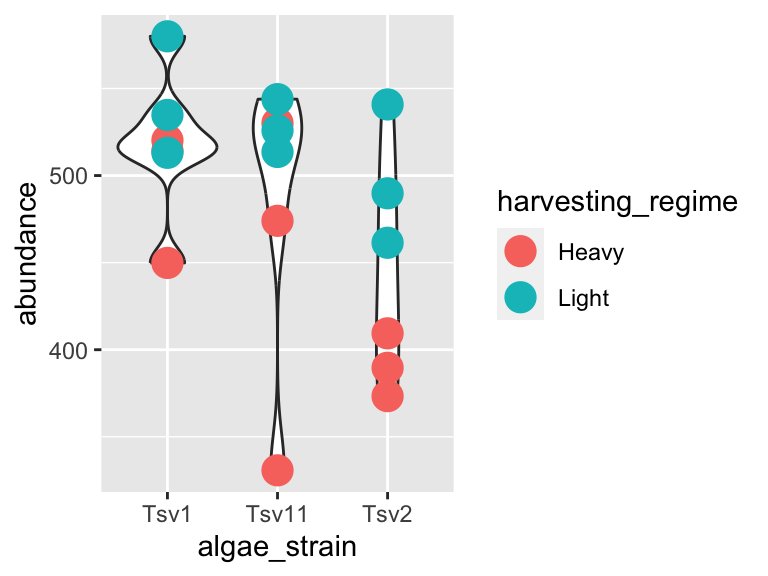

In the same way that we mapped variables in our dataset to the plot axes, we can map variables in the dataset to the geometric features of the shapes we are using to represent our data. For this, again, use `aes()` to map your variables onto the geometric features of the shapes:


```r
ggplot(data = algae_data_small, aes(x = algae_strain, y = abundance)) + 
  geom_point(aes(color = harvesting_regime))
```


In the plot above, the points are a bit small, how could we fix that? We can modify the features of the shapes by adding additional arguments to the `geom_*()` functions. To change the size of the points created by the `geom_point()` function, this means that we need to add the `size = ` argument. IMPORTANT! Please note that when we map a feature of a shape to a *variable* in our data(as we did with color/harvesting regime, above) then it goes *inside* aes(). In contrast, when we map a feature of a shape to a *constant*, it goes *outside* aes(). Here's an example:


```r
ggplot(data = algae_data_small, aes(x = algae_strain, y = abundance)) + 
  geom_point(aes(color = harvesting_regime), size = 5)
```

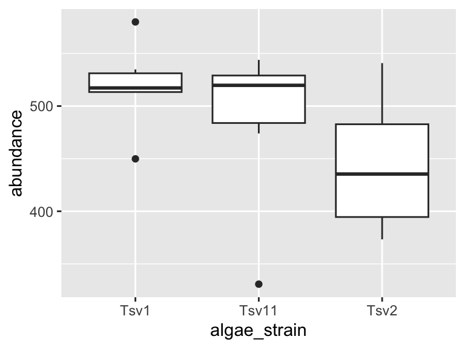

One powerful aspect of `ggplot` is the ability to quickly change mappings to see if alternative plots are more effective at bringing out the trends in the data. For example, we could modify the plot above by switching how harvesting_regime is mapped:


```r
ggplot(data = algae_data_small, aes(x = algae_strain, y = abundance)) +
  geom_point(aes(size = harvesting_regime), color = "black")
```


** Important note: Inside the `aes()` function, map aesthetics (the features of the geom's shape) to a *variable*. Outside the `aes()` function, map aesthetics to *constants*. You can see this in the above two plots - in the first one, color is inside `aes()` and mapped to the variable called harvesting_regime, while size is outside the `aes()` call and is set to the constant 5. In the second plot, the situation is reversed, with size being inside the `aes()` function and mapped to the variable harvesting_regime, while color is outside the `aes()` call and is mapped to the constant "black".

We can also stack geoms on top of one another by using multiple `+` signs. We also don't have to assign the same mappings to each geom.


```r
ggplot(data = algae_data_small, aes(x = algae_strain, y = abundance)) + 
  geom_violin() +
  geom_point(aes(color = harvesting_regime), size = 5)
```


As you can probably guess right now, there are lots of mappings that can be done, and lots of different ways to look at the same data!


```r
ggplot(data = algae_data_small, aes(x = algae_strain, y = abundance)) +
  geom_violin(aes(fill = algae_strain)) +
  geom_point(aes(color = harvesting_regime, size = replicate))
```


```r
ggplot(data = algae_data_small, aes(x = algae_strain, y = abundance)) +
  geom_boxplot()
```

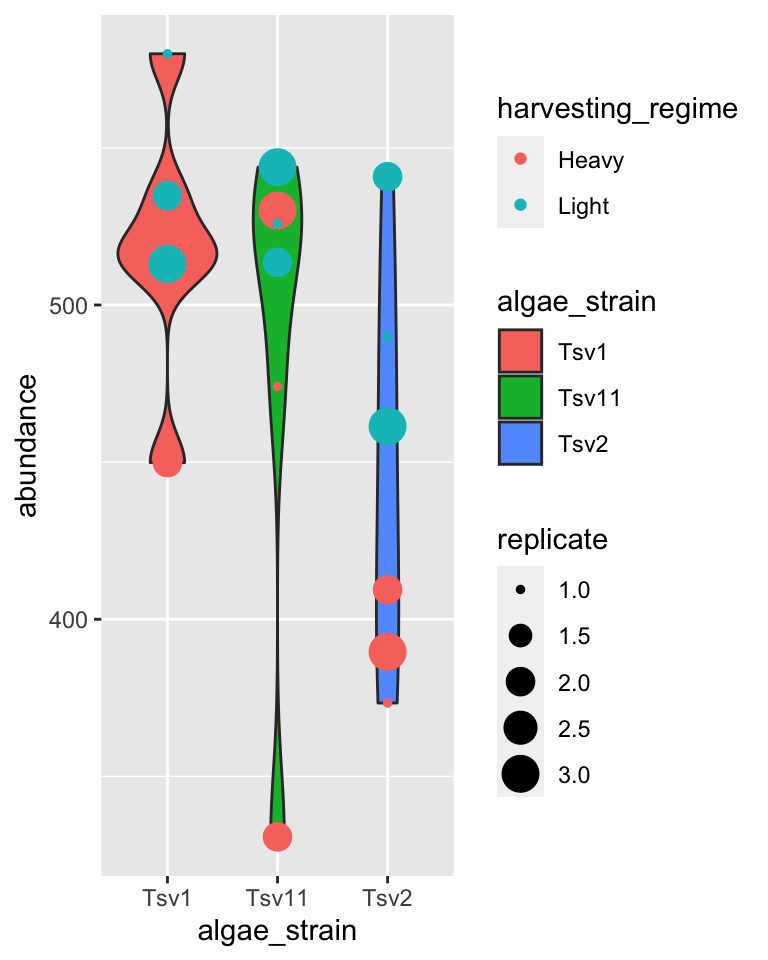

## markdown {-}

Now that we are able to filter our data and make plots, we are ready to make reports to show others the data processing and visualization that we are doing. For this, we will use R Markdown. You can open a new markdown document in RStudio by clicking: `File -> New File -> R Markdown`. You should get a template document that compiles when you press "knit".

Customize this document by modifying the title, and add `author: "your_name"` to the header. Delete all the content below the header, then compile again. You should get a page that is blank except for the title and the author name.

You can think of your markdown document as a stand-alone R Session. This means you will need to load our class code base into each new markdown doument you create. You can do this by adding a "chunk" or R code. That looks like this:


You can compilie this document into a pdf. We can also run R chunks right inside the document and create figures. You should notice a few things when you compile this document:

1. Headings: When you compile that code, the "# My first analysis" creates a header. You can create headers of various levels by increasing the number of hashtags you use in front of the header. For example, "## Part 1" will create a subheading, "### Part 1.1" will create a sub-subheading, and so on.

2. Plain text: Plain text in an R Markdown document creates a plan text entry in your compiled document. You can use this to explain your analyses and your figures, etc.

3. You can modify the output of a code chunk by adding arguments to its header. Useful arguments are fig.height, fig.width, and fig.cap. Dr. Busta will show you how to do this in class.

## exercises I {-}

In this set of exercises we're going to practice filtering and plotting data in R Markdown. We're going to work with two datasets: (i) algae_data and (ii) alaska_lake_data. **For these exercises, you will write your code and answers to all questions in an R Markdown report, compile it as a pdf, and submit it on Canvas. If you have any questions please let me know**

Some pointers:

- If your code goes off the page, don't be afraid to wrap it across multiple lines, as shown in some of the examples.

- Don't be afraid to put the variable with the long elements / long text on the y-axis and the continuous variable on the x-axis.

### algae {-}

1. You will have `algae_data` stored in an object called `algae_data` as soon as you run `source("https://thebustalab.github.io/phylochemistry/phylochemistry.R")`. For this question, filter the data so that only entries are shown for which the `chemical_species` is "FAs" (remember that quotes are needed around FAs here!). What are the dimensions (i.e. number of rows and columns) of the resulting dataset?


2. Now filter the dataset so that only entries for the `algae_strain` "Tsv1" are shown. What are the dimensions of the resulting dataset?


3. Now filter the dataset so that only entries with an abundance greater than 250 are shown. Note that `>` can be used in the filter command instead of `==`, and that numbers inside a filter command do not require quotes around them. What are the dimensions of the resulting dataset?


4. Make a ggplot that has `algae_strain` on the x axis and `abundance` on the y axis. Remember about `aes()`. Use points (`geom_point()`) to represent each compound. You don't need to color the points. Which algae strain has the most abundant compound out of all the compounds in the dataset?


5. Make a ggplot that has `abundance` on the x axis and `chemical_species` on the y axis. Use points to represent each compound. You don't need to color the points. Generally speaking, what are the two most abundant classes of chemical species in these algae strains? (FAs/Fas stand for fatty acids, AAs/Aas stand for amino acids.)


6. I am going to show you an example of how you can filter and plot at the same time. To do this, we nest the filter command inside ggplot's data argument:


```r
ggplot(
  data = filter(algae_data, chemical_species == "essential_Aas"),
  aes(x = algae_strain, y = abundance)) +
geom_point()
```


Using the above as a template, make a plot that shows just `omega_3_polyunsaturated_Fas`, with algae_strain on the x axis, and abundance on the y axis. Color the points so that they correspond to `harvesting_regime`. Remember that mapping a feature of a shape onto a variable must be done inside `aes()`. Change the plot so that all the points are size = 5. Remember that mapping features of a shape to a constant needs to be done outside `aes()`. Which harvesting regime leads to higher levels of `omega_3_polyunsaturated_Fas`?


7. Use a combination of filtering and plotting to show the abundance of the different chemical species in just the `algae_strain` called "Tsv1". Use an x and y axis, as well as points to represent the measurements. Make point size correspond to the replicate, and color the points according to harvesting regime.


8. Make a plot that checks to see which `chemical_species` were more abundant under light as opposed to heavy `harvesting_regime` in all three replicates. Use filtered data so that just one `algae_strain` is shown, an x and a y axis, and points to represent the measurements. Make the points `size = 5` and also set the point's `alpha = 0.6`. The points should be colored according to harvesting_regime. Make 3 plots, one for each strain of algae.


9. Take the code that you made for the question above. Remove the filtering. Add the following line to the end of the plot: `facet_grid(.~algae_strain)`. Remember that adding things to plots is done with the `+` sign, so your code should look something like:


```r
ggplot(data = algae_data, aes(x = <something>, y = <something else>)) +
  geom_point(aes(<some things>), <some here too>) +
  facet_grid(.~algae_strain)
```


Also try, instead of `facet_grid(.~algae_strain)`, `facet_grid(algae_strain~.)` at the end of you plot command. (note the swap in the position of the `.~` relative to `algae_strain`). This means your code should look something like:


```r
ggplot(data = algae_data, aes(x = <something>, y = <something else>)) +
  geom_point(aes(<some things>), <some here too>) +
  facet_grid(algae_strain~.)
```


What advantages does this one extra line (i.e. facet_grid) provide over what you had to do in question 8?

### alaska lakes {-}

1. Use R to view the first few lines of the `alaska_lake_data` dataset. Do your best to describe, in written format, the kind of data that are in this data set.


2. How many variables are in the Alaska lakes dataset?


3. Filter the data set so only meausurements of free elements (i.e. element_type is "free") are shown. Remember, it's `==`, not `=`. What are the dimensions of the resulting dataset?


4. Make a plot that shows the water temperatures of each lake. Don't worry if you get a warning message from R about "missing values". Which is the hottest lake? The coolest?


5. Make a plot that shows the water temperature of each lake. The x axis should be `park`, the y axis `water temp`. Add geom_violin() to the plot first, then geom_point(). Make the points size = 5. Color the points according to water_temp. Which park has four lakes with very similar temperatures?


6. From the plot you made for question 5, it should be apparent that there is one lake in NOAT that is much warmer than the others. Filter the data so that only entries from `park == "NOAT"` are shown (note the double equals sign and the quotes around NOAT...). Combine this filtering with plotting and use geom_point() to make a plot that shows which specific lake that is.


7. Make a plot that shows which lake has the highest abundance of sulfur.


8. Make a plot that uses geom_point(). Set the "shape" aesthetic of the points to 21, i.e. `geom_point(aes(...), shape = 21)`. This gives you access to a new aesthetics: `fill`. It also changes the behaviour of the `color` aesthetic slightly, in that it now controls border color, not the internal color. Here is an example (though it doesn't make a very nice plot):


```r
ggplot(
  data = filter(alaska_lake_data, lake == "Lake_Narvakrak"),
  aes(x = lake, y = mg_per_L)
) +
  geom_point(
    shape = 21, size = 10,
    color = "black", fill = "green"
  )
```


Now we have lots of aesthetics we can map to: x, y, size, color, and fill (leave shape set to 21 for now). Make a plot of your own design. It should include filtering, and all the aesthetics listed above, though whether you map them to a variable or a constant is up to you.


When you are done with this plot, take a screen shot of it. Go to [THIS GOOGLE SHEET](https://docs.google.com/presentation/d/1G0BJ_qye9a_HAPLktFytj66qSj20BjoUOTKtjmCyuN0/edit?usp=sharing), make a slide for yourself (you don't have to include your name), and paste your screen shot there. Add a small caption that explains how your variables are mapped.

## {-}

## more geoms {-}

We've looked at how to filter data and map variables in our data to geometric shapes to make plots. Let's have a look at a few more things. For these examples, we're going to use the data set called `solvents`. In these examples, I'd like to introduce you to two new geoms. The first `geom_smooth()` is used when there are two continuous variables. It is particularly nice when geom_point() is stacked on top of it.


```r
ggplot(data = solvents, aes(x = boiling_point, y = vapor_pressure)) + 
  geom_smooth() +
  geom_point()
## `geom_smooth()` using method = 'loess' and formula 'y ~ x'
```


Also, please be aware of `geom_tile()`, which is nice for situations with two discrete variables and one continuous variable. `geom_tile()` makes what are often referred to as heat maps. Note that `geom_tile()` is somewhat similar to `geom_point(shape = 21)`, in that it has both `fill` and `color` aesthetics that control the fill color and the border color, respectively.


```r
ggplot(
  data = filter(algae_data, harvesting_regime == "Heavy"),
  aes(x = algae_strain, y = chemical_species)
) + 
  geom_tile(aes(fill = abundance), color = "black", size = 1)
```


These examples should illustrate that there is, to some degree, correspondence between the type of data you are interested in plotting (number of discrete and continuous variables) and the types of geoms that can effectively be used to represent the data.


```r
i2 <- iris %>%
  mutate(Species2 = rep(c("A","B"), 75))
p <- ggplot(i2, aes(Sepal.Width, Sepal.Length, color = Species)) +
  geom_point()

p + geom_xsidedensity(aes(y=stat(density), xfill = Species), position = "stack")+
  geom_ysidedensity(aes(x=stat(density), yfill = Species2), position = "stack") +
  theme_bw() + 
  facet_grid(Species~Species2, space = "free", scales = "free") +
  labs(title = "FacetGrid", subtitle = "Collapsing All Side Panels") +
  ggside(collapse = "all") +
  scale_xfill_manual(values = c("darkred","darkgreen","darkblue")) +
  scale_yfill_manual(values = c("black","gold"))
```


There is a [handy cheat sheet](https://www.maths.usyd.edu.au/u/UG/SM/STAT3022/r/current/Misc/data-visualization-2.1.pdf) that can help you identify the right geom for your situation. Please keep this cheat sheet in mind for your future plotting needs...

## facets {-}

As alluded to in Exercises 1, it is possible to map variables in your dataset to more than the geometric features of shapes (i.e. geoms). One very common way of doing this is with facets. Faceting creates small multiples of your plot, each of which shows a different subset of your data based on a categorical variable of your choice. Let's check it out.

Here, we can facet in the horizontal direction:

```r
ggplot(data = algae_data, aes(x = algae_strain, y = chemical_species)) + 
  geom_tile(aes(fill = abundance), color = "black") + 
  facet_grid(.~replicate)
```


We can facet in the vertical direction:

```r
ggplot(data = algae_data, aes(x = algae_strain, y = chemical_species)) + 
  geom_tile(aes(fill = abundance), color = "black") + 
  facet_grid(replicate~.)
```

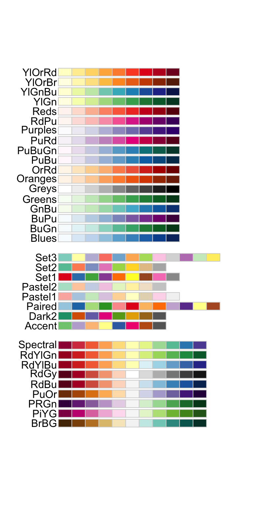

And we can do both at the same time:

```r
ggplot(data = algae_data, aes(x = algae_strain, y = chemical_species)) + 
  geom_tile(aes(fill = abundance), color = "black") + 
  facet_grid(harvesting_regime~replicate)
```


Faceting is a great way to describe more variation in your plot without having to make your geoms more complicated. For situations where you need to generate lots and lots of facets, consider `facet_wrap` instead of `facet_grid`:


```r
ggplot(data = algae_data, aes(x = replicate, y = algae_strain)) + 
  geom_tile(aes(fill = abundance), color = "black") + 
  facet_wrap(chemical_species~.)
```


<!-- HERE INTRODUCE COWPLOT!! -->


## scales {-}

Every time you define an aesthetic mapping (e.g. aes(x = algae_strain)), you are defining a new scale that is added to your plot. You can control these scales using the `scale_*` family of commands. Consider our faceting example above. In it, we use `geom_tile(aes(fill = abundance))` to map the abundance variable to the fill aesthetic of the tiles. This creates a scale called `fill` that we can adjust using `scale_fill_*`. In this case, fill is mapped to a continuous variable and so the fill scale is a color gradient. Therefore, `scale_fill_gradient()` is the command we need to change it. Remember that you could always type `?scale_fill_` into the console and it will help you find relevant help topics that will provide more detail. Another option is to google: "How to modify color scale ggplot geom_tile", which will undoubtedly turn up a wealth of help.


```r
ggplot(data = algae_data, aes(x = algae_strain, y = chemical_species)) + 
  geom_tile(aes(fill = abundance), color = "black") + 
  facet_grid(harvesting_regime~replicate) +
  scale_fill_gradient(low = "white", high = "black") +
  theme_classic()
```

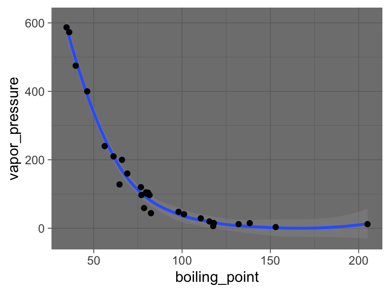

One particularly useful type of scale are the color scales provided by RColorBrewer:


```r
display.brewer.all()
```


```r
ggplot(mtcars) +
  geom_point(
    aes(x = mpg, y = factor(cyl), fill = factor(carb)), 
    shape = 21, size = 6
  ) +
  scale_fill_brewer(palette = "Set1")
```


  
## themes {-}
  
So far we've just looked at how to control the means by which your *data* is represented on the plot. There are also components of the plot that are, strictly speaking, not *data* per se, but rather non-data ink. These are controlled using the `theme()` family of commands. There are two ways to go about this.

`ggplot` comes with a handful of built in "complete themes". These will change the appearance of your plots with respect to the non-data ink. Compare the following plots:


```r
ggplot(data = solvents, aes(x = boiling_point, y = vapor_pressure)) + 
  geom_smooth() +
  geom_point() +
  theme_classic()
## `geom_smooth()` using method = 'loess' and formula 'y ~ x'
```


```r
ggplot(data = solvents, aes(x = boiling_point, y = vapor_pressure)) + 
  geom_smooth() +
  geom_point() +
  theme_dark()
## `geom_smooth()` using method = 'loess' and formula 'y ~ x'
```


  

```r
ggplot(data = solvents, aes(x = boiling_point, y = vapor_pressure)) + 
  geom_smooth() +
  geom_point() +
  theme_void()
## `geom_smooth()` using method = 'loess' and formula 'y ~ x'
```


You can also change individual components of themes. This can be a bit tricky, but it's all explained if you run `?theme()`. Hare is an example (and google will provide many, many more).


```r
ggplot(data = solvents, aes(x = boiling_point, y = vapor_pressure)) + 
  geom_smooth() +
  geom_point() +
  theme(
    text = element_text(size = 20, color = "black")
  )
## `geom_smooth()` using method = 'loess' and formula 'y ~ x'
```


Last, here is an example of combining `scale_*` and `theme*` with previous commands to really get a plot looking sharp.


```r
ggplot(data = solvents, aes(x = boiling_point, y = vapor_pressure)) + 
  geom_smooth(color = "#4daf4a") +
  scale_x_continuous(
    name = "Boiling Point", breaks = seq(0,200,25), limits = c(30,210)
  ) +
  scale_y_continuous(
    name = "Vapor Pressure", breaks = seq(0,600,50)
  ) +
  geom_point(color = "#377eb8", size = 4, alpha = 0.6) +
  theme_bw() +
  theme(
    axis.text = element_text(color = "black"),
    text = element_text(size = 16, color = "black")
  )
## `geom_smooth()` using method = 'loess' and formula 'y ~ x'
```

<div class="figure" style="text-align: center">

<p class="caption">(\#fig:unnamed-chunk-71)Vapor pressure as a function of boiling point. A scatter plot with trendline showing the vapor pressure of thirty-two solvents (y-axis) a as a function of their boiling points (x-axis). Each point represents the boiling point and vapor pressure of one solvent. Data are from the 'solvents' dataset used in UMD CHEM5725.</p>
</div>

## subplots {-}

We can make subplots using the `patchwork` package, which comes with the `source()` command. Let's see:


```r
plot1 <-  ggplot(
            filter(alaska_lake_data, element_type == "free")
          ) +
          geom_violin(aes(x = park, y = mg_per_L)) + theme_classic() +
          ggtitle("A")

plot2 <-  ggplot(
            filter(alaska_lake_data, element_type == "bound")
          ) +
          geom_violin(aes(x = park, y = mg_per_L)) + theme_classic() +
          ggtitle("B")

plot3 <-  ggplot(
            filter(alaska_lake_data, element == "C")
          ) +
          geom_violin(aes(x = park, y = mg_per_L)) + theme_classic() +
          coord_flip() + ggtitle("C")

(plot1 + plot2) / plot3
```


## data vis exercises II {-}

In this set of exercises we're going to practice making more plots using the dataset `solvents`. Well, you don't have to use `solvents`, you could use something else if you want, but `solvents` is a fun one to explore. Since you are now familiar with filtering and plotting data, the prompts in this assignment are going to be relatively open ended - I do not care what variables you map to x, y, fill, color, etc. Rather, I expect your submission to demonstrate to me that you have explored each of the new topics covered in the previous chapter. This includes geoms beyond `geom_point()` and `geom_violin()`, facets, scale modifications, and theme adjustments. Be creative! Explore the solvents dataset. Find something interesting! **Show me that you have mastered this material.** Don't forget about the ggplot cheat sheet (see the "Links" section in this book).

As before, for these exercises, you will write your code and answers to any questions in the Script Editor window of your RStudio as an R Markdown document. You will compile that file as a pdf and submit it on Canvas. If you have any questions please let me know.

Some pointers:

- If your code goes off the page, don't be afraid to wrap it across multiple lines, as shown in some of the examples in the previous set of exercises.

- Don't be afraid to put the variable with the long elements / long text on the y-axis and the continuous variable on the x-axis.

1. Create a plot that has x and y axes that are continuous variables. Add to this plot `facet_grid`, and specify that the facets should be based on a categorical variable (ideally a categorical variable with a small number of total categories). Now make two versions of that plot, one that uses the `scales = "free"` feature of `facet_grid` and a second the other does not (i.e. one should use `facet_grid(<things>)`, while the other uses `facet_grid(<things>, scales = "free")`). Write a single caption that describes *both* plots, highlighting the advantages provided by each plot over the other. For additional tips on writing captions, please see the "Writing" chapter in this book.

2. Using a continuous variable on one axis and a discrete (categorical) variable on the other, create two plots that are identical except that one uses `geom_point()`, while the other uses `geom_jitter()`. Write a single caption that describes *both* plots. The caption should highlight the differences bewteen these two plots and it should describe case(s) in which you think it would be appropriate to use `geom_jitter()` over `geom_point()`.

3. Make a plot that has four aesthetic mappings (x and y mappings count). Use the `scales_*` family of commands to modify some aspect of each scale create by the four mappings. Hint: some scales are somewhat tricky to modify (alpha, linetype, ...), and some scales are easier to modify (x, y, color, fill, shape). You may need to use some google searches to help you. Queries along the lines of "how to modify point color in ggplot" should direct you to a useful resource.

4. Make a plot and manually modify at least three aspects of its theme (i.e. do not use one of the build in complete themes such as `theme_classic()`, rather, manually modify components of the theme using `theme()`). This means that inside your `theme()` command, there should be three arguments separated by commas.

5. Identify a relationship between two variables in the dataset. Create a plot that is optimized (see note) to highlight the features of this relationship. Write a short caption that describes the plot *and* the trend you've identified and highlighted. Note: I realize that the word "optimize" is not clearly defined here. That's ok! You are the judge of what is optimized and what is not. Use your caption to make a case for *why* your plot is optimized. *Defend* your ideas with argument!

6. Watch [this video](https://www.youtube.com/watch?v=LFDbqw2xPbQ) on bar plots. Add a section to the end of the R Markdown document you made for Part 2 that describes the problem outlined in the video and one potential solution to the problem.

## {-}

## further reading {-}

Check out some of the incredible geoms that are easy to access using R and ggplot2: [R Graph Gallery](https://r-graph-gallery.com/). Use these to make your figures attractive and easy to interpret!

For a challenge, try implementing these awesome color scales: [Famous R Color Palettes](https://www.datanovia.com/en/blog/top-r-color-palettes-to-know-for-great-data-visualization/). Note that some of these are optimized for colorblind individuals and that other are optimized for continuous hue gradients, etc.

For a list of data visualization sins: [Friends Don't Let Friends](https://github.com/cxli233/FriendsDontLetFriends). Some interesting things in here!

For more information on data visualization and graphics theory, check out the works by Edward Tufte: [Edward Tufte](https://www.edwardtufte.com/tufte/). A digital text that covers similar topics is here: [Look At Data] (https://socviz.co/lookatdata.html).

Some examples of award winning data visualization: [Information Is Beautiful Awards](https://www.informationisbeautifulawards.com/showcase?award=2019&type=awards).

<!-- end -->

<!-- start data wrangling -->
# data wrangling {-}


Data wrangling refers to the process of organizing, cleaning up, and making a "raw" data set more ready for downstream analysis. It is a key piece of any data analysis process. Here we will look at a few different aspects of wrangling, including data import, subsetting, pivoting, and summarizing data.

## data import {-}

To analyze data that is stored on your own computer you can indeed import it into RStudio.

The easiest way to do this is to use the interactive command `readCSV()`, a function that comes with the phylochemistry source command. You run `readCSV()` in your console, then navigate to the data on your hard drive.

Another option is to read the data in from a path. For this, you will need to know the "path" to your data file. This is essentially the street address of your data on your computer's hard drive. Paths look different on Mac and PC.

* On Mac: `/Users/lucasbusta/Documents/sample_data_set.csv` (note the forward slashes!)
* On PC: `C:\\My Computer\\Documents\\sample_data_set.csv` (note double backward slashes!)

You can quickly find paths to files via the following:

* On Mac: Locate the file in Finder. Right-click on the file, hold the Option key, then click "Copy <file> as Pathname"
* On PC: Locate the file in Windows Explorer. Hold down the Shift key then right-click on the file. Click "Copy As Path"

With these paths, we can read in data using the `read_csv` command. We'll run `read_csv("<path_to_your_data>")`. Note the use of QUOTES `""`! Those are necessary. Also make sure your path uses the appropriate direction of slashes for your operating system.

## subsetting {-}

So far, we have always been passing whole data sets to ggplot to do our plotting. However, suppose we wanted to get at just certain portions of our dataset, say, specific columns, or specific rows? Here are a few ways to do that:


```r
# To look at a single column (the third column)
head(alaska_lake_data[,3])
## # A tibble: 6 × 1
##   water_temp
##        <dbl>
## 1       6.46
## 2       6.46
## 3       6.46
## 4       6.46
## 5       6.46
## 6       6.46

# To look at select columns:
head(alaska_lake_data[,2:5])
## # A tibble: 6 × 4
##   park  water_temp    pH element
##   <chr>      <dbl> <dbl> <chr>  
## 1 BELA        6.46  7.69 C      
## 2 BELA        6.46  7.69 N      
## 3 BELA        6.46  7.69 P      
## 4 BELA        6.46  7.69 Cl     
## 5 BELA        6.46  7.69 S      
## 6 BELA        6.46  7.69 F

# To look at a single row (the second row)
head(alaska_lake_data[2,])
## # A tibble: 1 × 7
##   lake  park  water_temp    pH element mg_per_L element_type
##   <chr> <chr>      <dbl> <dbl> <chr>      <dbl> <chr>       
## 1 Devi… BELA        6.46  7.69 N          0.028 bound

# To look at select rows:
head(alaska_lake_data[2:5,])
## # A tibble: 4 × 7
##   lake  park  water_temp    pH element mg_per_L element_type
##   <chr> <chr>      <dbl> <dbl> <chr>      <dbl> <chr>       
## 1 Devi… BELA        6.46  7.69 N          0.028 bound       
## 2 Devi… BELA        6.46  7.69 P          0     bound       
## 3 Devi… BELA        6.46  7.69 Cl        10.4   free        
## 4 Devi… BELA        6.46  7.69 S          0.62  free

# To look at just a single column, by name
head(alaska_lake_data$pH)
## [1] 7.69 7.69 7.69 7.69 7.69 7.69

# To look at select columns by name
head(select(alaska_lake_data, park, water_temp))
## # A tibble: 6 × 2
##   park  water_temp
##   <chr>      <dbl>
## 1 BELA        6.46
## 2 BELA        6.46
## 3 BELA        6.46
## 4 BELA        6.46
## 5 BELA        6.46
## 6 BELA        6.46
```

## tidy data {-}

When we make data tables by hand, it's often easy to make a **wide-style table** like the following. In it, the abundances of 7 different fatty acids in 10 different species are tabulated. Each fatty acid gets its own row, each species, its own column.


```r
head(fadb_sample)
## # A tibble: 6 × 11
##   fatty_acid         Agonandra_brasiliensis Agonandra_silva…
##   <chr>                               <dbl>            <dbl>
## 1 Hexadecanoic acid                     3.4              1  
## 2 Octadecanoic acid                     6.2              0.1
## 3 Eicosanoic acid                       4.7              3.5
## 4 Docosanoic acid                      77.4              0.4
## 5 Tetracosanoic acid                    1.4              1  
## 6 Hexacosanoic acid                     1.9             12.6
## # … with 8 more variables: Agonandra_excelsa <dbl>,
## #   Heisteria_silvianii <dbl>, Malania_oleifera <dbl>,
## #   Ximenia_americana <dbl>, Ongokea_gore <dbl>,
## #   Comandra_pallida <dbl>, Buckleya_distichophylla <dbl>,
## #   Nuytsia_floribunda <dbl>
```

While this format is very nice for filling in my hand (such as in a lab notebook or similar), it does not groove with ggplot and other `tidyverse` functions very well. We need to convert it into a **long-style table**. This is done using `pivot_longer()`. You can think of this function as transforming both your data's column names (or some of the column names) and your data matrix's values (in this case, the measurements) each into their own variables (i.e. columns). We can do this for our fatty acid dataset using the command below. In it, we specify what data we want to transform (`data = fadb_sample`), we need to tell it what columns we want to transform (`cols = 2:11`), what we want the new variable that contains column names to be called (`names_to = "plant_species"`) and what we want the new variable that contains matrix values to be called (`values_to = "relative_abundance"`). All together now:


```r
pivot_longer(data = fadb_sample, cols = 2:11, names_to = "plant_species", values_to = "relative_abundance")
## # A tibble: 70 × 3
##    fatty_acid        plant_species          relative_abunda…
##    <chr>             <chr>                             <dbl>
##  1 Hexadecanoic acid Agonandra_brasiliensis              3.4
##  2 Hexadecanoic acid Agonandra_silvatica                 1  
##  3 Hexadecanoic acid Agonandra_excelsa                   1.2
##  4 Hexadecanoic acid Heisteria_silvianii                 2.9
##  5 Hexadecanoic acid Malania_oleifera                    0.7
##  6 Hexadecanoic acid Ximenia_americana                   3.3
##  7 Hexadecanoic acid Ongokea_gore                        1  
##  8 Hexadecanoic acid Comandra_pallida                    2.3
##  9 Hexadecanoic acid Buckleya_distichophyl…              1.6
## 10 Hexadecanoic acid Nuytsia_floribunda                  3.8
## # … with 60 more rows
```

Brilliant! Now we have a tidy, long-style table that can be used with ggplot.

## the pipe (%>%) {-}

We have seen how to create new objects using `<-`, and we have been filtering and plotting data using, for example:


```r
ggplot(filter(alaska_lake_data, park == "BELA"), aes(x = pH, y = lake)) + geom_col()
```


However, as our analyses get more complex, the code can get long and hard to read. We're going to use the pipe `%>%` to help us with this. Check it out:


```r
alaska_lake_data %>%
  filter(park == "BELA") %>%
  ggplot(aes(x = pH, y = lake)) + geom_col()
```

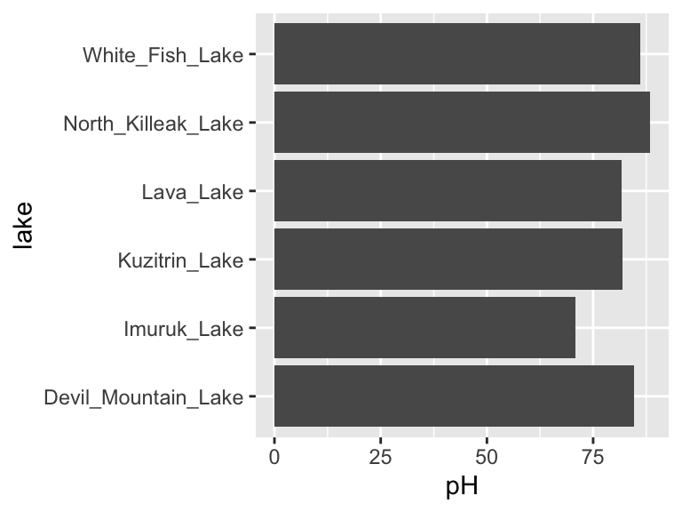

Neat! Another way to think about the pipe:


The pipe will become more important as our analyses become more sophisticated, which happens very quickly when we start working with summary statistics, as we shall now see...

## summary statistics {-}

So far, we have been plotting raw data. This is well and good, but it is not always suitable. Often we have scientific questions that cannot be answered by looking at raw data alone, or sometimes there is too much raw data to plot. For this, we need summary statistics - things like averages, standard deviations, and so on. While these metrics can be computed in Excel, programming such can be time consuming, especially for group statistics. Consider the example below, which uses the `ny_trees` dataset. The NY Trees dataset contains information on nearly half a million trees in New York City (this is after considerable filtering and simplification):


```r
head(ny_trees)
## # A tibble: 6 × 14
##   tree_height tree_diameter address        tree_loc pit_type
##         <dbl>         <dbl> <chr>          <chr>    <chr>   
## 1        21.1             6 1139 57 STREET Front    Sidewal…
## 2        59.0             6 2220 BERGEN A… Across   Sidewal…
## 3        92.4            13 2254 BERGEN A… Across   Sidewal…
## 4        50.2            15 2332 BERGEN A… Across   Sidewal…
## 5        95.0            21 2361 EAST   7… Front    Sidewal…
## 6        67.5            19 2409 EAST   7… Front    Continu…
## # … with 9 more variables: soil_lvl <chr>, status <chr>,
## #   spc_latin <chr>, spc_common <chr>, trunk_dmg <chr>,
## #   zipcode <dbl>, boroname <chr>, latitude <dbl>,
## #   longitude <dbl>
```

More than 300,000 observations of 14 variables! That's 4.2M data points! Now, what is the average and standard deviation of the height and diameter of each tree species within each NY borough? Do those values change for trees that are in parks versus sidewalk pits?? I don't even know how one would begin to approach such questions using traditional spreadsheets. Here, we will answer these questions with ease using two new commands: `group_by()` and `summarize()`. Let's get to it.

Say that we want to know (and of course, visualize) the mean and standard deviation of the heights of each tree species in NYC. We can see that data in first few columns of the NY trees dataset above, but how to calculate these statistics? In R, mean can be computed with `mean()` and standard deviation can be calculated with `sd()`. We will use the function `summarize()` to calculate summary statistics. So, we can calculate the average and standard deviation of all the trees in the data set as follows:


```r
ny_trees %>%
  summarize(mean_height = mean(tree_height))
## # A tibble: 1 × 1
##   mean_height
##         <dbl>
## 1        72.6

ny_trees %>%
  summarize(stdev_height = sd(tree_height))
## # A tibble: 1 × 1
##   stdev_height
##          <dbl>
## 1         28.7
```

Great! But how to do this for each species? We need to subdivide the data by species, then compute the mean and standard deviation, then recombine the results into a new table. First, we use `group_by()`. Note that in ny_trees, species are indicated in the column called `spc_latin`. Once the data is grouped, we can use `summarize()` to compute statistics.


```r
ny_trees %>%
  group_by(spc_latin) %>%
  summarize(mean_height = mean(tree_height))
## # A tibble: 12 × 2
##    spc_latin              mean_height
##    <chr>                        <dbl>
##  1 ACER PLATANOIDES              82.6
##  2 ACER RUBRUM                  106. 
##  3 ACER SACCHARINUM              65.6
##  4 FRAXINUS PENNSYLVANICA        60.6
##  5 GINKGO BILOBA                 90.4
##  6 GLEDITSIA TRIACANTHOS         53.0
##  7 PLATANUS ACERIFOLIA           82.0
##  8 PYRUS CALLERYANA              21.0
##  9 QUERCUS PALUSTRIS             65.5
## 10 QUERCUS RUBRA                111. 
## 11 TILIA CORDATA                 98.8
## 12 ZELKOVA SERRATA              101.
```

Bam. Mean height of each tree species. We can also count the number of observations using `n()`:


```r
ny_trees %>%
  group_by(spc_latin) %>%
  summarize(number_of_individuals = n())
## # A tibble: 12 × 2
##    spc_latin              number_of_individuals
##    <chr>                                  <int>
##  1 ACER PLATANOIDES                       67260
##  2 ACER RUBRUM                            11506
##  3 ACER SACCHARINUM                       13161
##  4 FRAXINUS PENNSYLVANICA                 16987
##  5 GINKGO BILOBA                          15672
##  6 GLEDITSIA TRIACANTHOS                  48707
##  7 PLATANUS ACERIFOLIA                    80075
##  8 PYRUS CALLERYANA                       39125
##  9 QUERCUS PALUSTRIS                      37058
## 10 QUERCUS RUBRA                          10020
## 11 TILIA CORDATA                          25970
## 12 ZELKOVA SERRATA                        13221
```

Cool! `summarize()` is more powerful though, we can do many summary statistics at once:


```r
ny_trees %>%
  group_by(spc_latin) %>%
  summarize(
    mean_height = mean(tree_height),
    stdev_height = sd(tree_height)
  ) -> ny_trees_by_spc_summ
ny_trees_by_spc_summ
## # A tibble: 12 × 3
##    spc_latin              mean_height stdev_height
##    <chr>                        <dbl>        <dbl>
##  1 ACER PLATANOIDES              82.6        17.6 
##  2 ACER RUBRUM                  106.         15.7 
##  3 ACER SACCHARINUM              65.6        16.6 
##  4 FRAXINUS PENNSYLVANICA        60.6        21.3 
##  5 GINKGO BILOBA                 90.4        24.5 
##  6 GLEDITSIA TRIACANTHOS         53.0        13.0 
##  7 PLATANUS ACERIFOLIA           82.0        16.0 
##  8 PYRUS CALLERYANA              21.0         5.00
##  9 QUERCUS PALUSTRIS             65.5         6.48
## 10 QUERCUS RUBRA                111.         20.7 
## 11 TILIA CORDATA                 98.8        32.6 
## 12 ZELKOVA SERRATA              101.         10.7
```

Now we can use this data in plotting. For this, we will use a new geom, `geom_pointrange`, which takes `x` and `y` aesthetics, as usual, but also requires two additional y-ish aesthetics `ymin` and `ymax` (or `xmin` and `xmax` if you want them to vary along x). Also, note that in the aesthetic mappings for `xmin` and `xmax`, we can use a mathematical expression: `mean-stdev` and `mean+stdev`, respectivey. In our case, these are `mean_height - stdev_height` and `mean_height + stdev_height`. Let's see it in action:


```r
ny_trees_by_spc_summ %>%
ggplot() +
  geom_pointrange(
      aes(
        y = spc_latin,
        x = mean_height,
        xmin = mean_height - stdev_height,
        xmax = mean_height + stdev_height
      )
    )
```


Cool! Just like that, we've found (and visualized) the average and standard deviation of tree heights, by species, in NYC. But it doesn't stop there. We can use `group_by()` and `summarize()` on multiple variables (i.e. more groups). We can do this to examine the properties of each tree species in each NYC borough. Let's check it out:


```r
ny_trees %>%
  group_by(spc_latin, boroname) %>%
  summarize(
    mean_diam = mean(tree_diameter),
    stdev_diam = sd(tree_diameter)
  ) -> ny_trees_by_spc_boro_summ
ny_trees_by_spc_boro_summ
## # A tibble: 48 × 4
## # Groups:   spc_latin [12]
##    spc_latin        boroname  mean_diam stdev_diam
##    <chr>            <chr>         <dbl>      <dbl>
##  1 ACER PLATANOIDES Bronx         13.9        6.74
##  2 ACER PLATANOIDES Brooklyn      15.4       14.9 
##  3 ACER PLATANOIDES Manhattan     11.6        8.45
##  4 ACER PLATANOIDES Queens        15.1       12.9 
##  5 ACER RUBRUM      Bronx         11.4        7.88
##  6 ACER RUBRUM      Brooklyn      10.5        7.41
##  7 ACER RUBRUM      Manhattan      6.63       4.23
##  8 ACER RUBRUM      Queens        14.1        8.36
##  9 ACER SACCHARINUM Bronx         19.7       10.5 
## 10 ACER SACCHARINUM Brooklyn      22.2       10.1 
## # … with 38 more rows
```

Now we have summary statistics for each tree species within each borough. This is different from the previous plot in that we now have an additional variable (boroname) in our summarized dataset. This additional variable needs to be encoded in our plot. Let's map boroname to x and facet over tree species, which used to be on x. We'll also manually modify the theme element `strip.text.y` to get the species names in a readable position.


```r
ny_trees_by_spc_boro_summ %>%
ggplot() +
  geom_pointrange(
    aes(
      y = boroname,
      x = mean_diam,
      xmin = mean_diam-stdev_diam,
      xmax = mean_diam+stdev_diam
    )
  ) +
  facet_grid(spc_latin~.) +
  theme(
    strip.text.y = element_text(angle = 0)
  )
```


Excellent! And if we really want to go for something pretty:


```r
ny_trees_by_spc_boro_summ %>%
ggplot() +
  geom_pointrange(
    aes(
      y = boroname,
      x = mean_diam,
      xmin = mean_diam-stdev_diam,
      xmax = mean_diam+stdev_diam,
      fill = spc_latin
    ), color = "black", shape = 21
  ) +
  labs(
    y = "Borough", 
    x = "Trunk diameter",
    caption = str_wrap("Figure 1: Diameters of trees in New York City. Points correspond to average diameters of each tree species in each borough. Horizontal lines indicate the standard deviation of tree diameters. Points are colored according to tree species.", width = 80)
  ) +
  facet_grid(spc_latin~.) +
  guides(fill = "none") +
  scale_fill_brewer(palette = "Paired") +
  theme_bw() +
  theme(
    strip.text.y = element_text(angle = 0),
    plot.caption = element_text(hjust = 0.5)
  )
```


*Now* we are getting somewhere. It looks like there are some really big maple trees (Acer) in Queens.

## ordering {-}

We can also sort or order a data frame based on a specific column with the command `arrange()`. Let's have a quick look. Suppose we wanted to know which lake was the coldest:


```r
arrange(alaska_lake_data, water_temp)
## # A tibble: 220 × 7
##    lake             park  water_temp    pH element mg_per_L
##    <chr>            <chr>      <dbl> <dbl> <chr>      <dbl>
##  1 Desperation_Lake NOAT        2.95  6.34 C          2.1  
##  2 Desperation_Lake NOAT        2.95  6.34 N          0.005
##  3 Desperation_Lake NOAT        2.95  6.34 P          0    
##  4 Desperation_Lake NOAT        2.95  6.34 Cl         0.2  
##  5 Desperation_Lake NOAT        2.95  6.34 S          2.73 
##  6 Desperation_Lake NOAT        2.95  6.34 F          0.01 
##  7 Desperation_Lake NOAT        2.95  6.34 Br         0    
##  8 Desperation_Lake NOAT        2.95  6.34 Na         1.11 
##  9 Desperation_Lake NOAT        2.95  6.34 K          0.16 
## 10 Desperation_Lake NOAT        2.95  6.34 Ca         5.87 
## # … with 210 more rows, and 1 more variable:
## #   element_type <chr>
```

Or suppose we wanted to know which was the warmest?


```r
arrange(alaska_lake_data, desc(water_temp))
## # A tibble: 220 × 7
##    lake      park  water_temp    pH element mg_per_L
##    <chr>     <chr>      <dbl> <dbl> <chr>      <dbl>
##  1 Lava_Lake BELA        20.2  7.42 C          8.3  
##  2 Lava_Lake BELA        20.2  7.42 N          0.017
##  3 Lava_Lake BELA        20.2  7.42 P          0.001
##  4 Lava_Lake BELA        20.2  7.42 Cl         2.53 
##  5 Lava_Lake BELA        20.2  7.42 S          0.59 
##  6 Lava_Lake BELA        20.2  7.42 F          0.04 
##  7 Lava_Lake BELA        20.2  7.42 Br         0.01 
##  8 Lava_Lake BELA        20.2  7.42 Na         2.93 
##  9 Lava_Lake BELA        20.2  7.42 K          0.57 
## 10 Lava_Lake BELA        20.2  7.42 Ca        11.8  
## # … with 210 more rows, and 1 more variable:
## #   element_type <chr>
```

`arrange()` will work on grouped data, which is particularly useful in combination with `slice()`, which can show us the first n elements in each group:


```r
alaska_lake_data %>%
  group_by(park) %>%
  arrange(water_temp) %>%
  slice(1)
## # A tibble: 3 × 7
## # Groups:   park [3]
##   lake  park  water_temp    pH element mg_per_L element_type
##   <chr> <chr>      <dbl> <dbl> <chr>      <dbl> <chr>       
## 1 Devi… BELA        6.46  7.69 C            3.4 bound       
## 2 Wild… GAAR        5.5   6.98 C            6.5 bound       
## 3 Desp… NOAT        2.95  6.34 C            2.1 bound
```

It looks like the coldest lakes in the three parks are Devil Mountain Lake, Wild Lake, and Desperation Lake!

## mutate {-}

One last thing before our exercises... there is another command called `mutate()`. It is like summarize it calculates user-defined statistics, but it creates output on a per-observation level instead of for each group. This means that it doesn't make the data set smaller, in fact it makes it bigger, by creating a new row for the new variables defined inside `mutate()`. It can also take grouped data. This is really useful for calculating percentages within groups. For example: within each park, what percent of the park's total dissolved sulfur does each lake have?


```r
alaska_lake_data %>%
  filter(element == "S") %>%
  group_by(park) %>%
  select(lake, park, element, mg_per_L) %>%
  mutate(percent_S = mg_per_L/sum(mg_per_L)*100)
## # A tibble: 20 × 5
## # Groups:   park [3]
##    lake                park  element mg_per_L percent_S
##    <chr>               <chr> <chr>      <dbl>     <dbl>
##  1 Devil_Mountain_Lake BELA  S           0.62     32.3 
##  2 Imuruk_Lake         BELA  S           0.2      10.4 
##  3 Kuzitrin_Lake       BELA  S           0.29     15.1 
##  4 Lava_Lake           BELA  S           0.59     30.7 
##  5 North_Killeak_Lake  BELA  S           0.04      2.08
##  6 White_Fish_Lake     BELA  S           0.18      9.38
##  7 Iniakuk_Lake        GAAR  S          12.1      13.2 
##  8 Kurupa_Lake         GAAR  S          12.4      13.6 
##  9 Lake_Matcharak      GAAR  S          13.3      14.5 
## 10 Lake_Selby          GAAR  S           7.92      8.64
## 11 Nutavukti_Lake      GAAR  S           2.72      2.97
## 12 Summit_Lake         GAAR  S           3.21      3.50
## 13 Takahula_Lake       GAAR  S           5.53      6.03
## 14 Walker_Lake         GAAR  S           5.77      6.30
## 15 Wild_Lake           GAAR  S          28.7      31.3 
## 16 Desperation_Lake    NOAT  S           2.73     25.8 
## 17 Feniak_Lake         NOAT  S           4.93     46.5 
## 18 Lake_Kangilipak     NOAT  S           0.55      5.19
## 19 Lake_Narvakrak      NOAT  S           1.38     13.0 
## 20 Okoklik_Lake        NOAT  S           1.01      9.53
```

The percent columns for each park add to 100%, so, for example, Devil Mountain Lake has 32.3% of BELA's dissolved sulfur.

## exercises {-}

Isn’t seven the most powerfully magical number? *Isn’t seven the most powerfully magical number?* Yes... I think the idea of a seven-part assignment would greatly appeal to an alchemist.

In this set of exercises we are going to use the periodic table. After you run source() you can load that data set using `periodic_table`. Please use that dataset to run analyses and answer the following questions/prompts. Compile the answers in an R Markdown document, compile it as a pdf, and upload it to the Canvas assignment. Please let me know if you have any questions. Good luck, and have fun!

Some pointers:

- If your code goes off the page, please wrap it across multiple lines, as shown in some of the examples in the previous set of exercises.

- Don't be afraid to put the variable with the long elements / long text on the y-axis and the continuous variable on the x-axis.

- If your axis tick labels are overlapping or not visible, do something to fix that. Some solutions could be: move the legend to the top of the plot (`theme(legend.position = "top")`), rotate the text (`theme(axis.text.x = element_text(angle = 90)`), or make the text smaller (`theme(axis.text.x = element_text(size = 8)`).

1. Make a plot using `geom_point()` that shows the average atomic weight of the elements discovered in each year spanned by the dataset (i.e. what was the average weight of the elements discovered in 1900? 1901? 1902? etc.). You should see a trend, particularly after 1950. What do you think has caused this trend?


2. The column `state_at_RT` indicates the state of each element at room temperate. Make a plot that shows the average first ionization potential of all the elements belonging to each state group indicated in `state_at_RT` (i.e. what is the average 1st ionization potential of all elements that are solid at room temp? liquid? etc.). Which is the highest?


3. Filter the dataset so that only elements with atomic number less than 85 are included. Considering only these elements, what is the average and standard deviation of boiling points for each type of `crystal_structure`? Make a plot using `geom_pointrange()` that shows the mean and standard deviation of each of these groups. What's up with elements that have a cubic crystal structure?


4. Now filter the original dataset so that only elements with atomic number less than 37 are considered. The elements in this dataset belong to the first four periods. What is the average abundance of each of these four *periods* in seawater? i.e. what is the average abundance of all elements from period 1? period 2? etc. Which period is the most abundant? In this context what does "CHON" mean? (not the rock band, though they are also excellent, especially that song that features GoYama)


5. Now filter the original dataset so that only elements with atomic number less than 103 are considered. Filter it further so that elements from group number 18 are excluded. Using this twice-filtered dataset, compute the average, minimum, and maximum values for electronegativiy for each `group_number`. Use `geom_point()` and `geom_errorbar()` to illustrate the average, minimum, and maximum values for each group number.


6. Filter the dataset so that only elements with atomic number less than 85 are considered. Group these by `color`. Now filter out those that have `color == "colorless"`. Of the remaining elements, which has the widest range of specific heats? Use `geom_point()` and `geom_errorbar()` to illustrate the mean and standard deviation of each color's specific heats.


7. You have learned many things in this course so far. `read_csv()`, `filter()`, `ggplot()`, and now `group_by()`, `summarize()`, `mutate()`, `arrange()`, and `slice()`. Using **all** these commands, create one or more graphics to illustrate what you consider to be one or more interesting trends in a data set of your own choosing. Use theme elements and scales to enhance your plot. Give your plot a nice caption based on the caption guide in this book. Impress me!

## further reading {-}

Be sure to check out the Tidy Data Tutor: https://tidydatatutor.com/vis.html. An easy way to visualize what's going on during data wrangling!

<!-- end -->

<!-- start dimensionality reduction -->

# dimensionality reduction {-}


In the previous chapters, we looked at how to explore our data sets by visualizing many variables and manually identifying trends. Sometimes, we encounter data sets with so many variables, that it is not reasonable to manually select certain variables with which to create plots and manually search for trends. In these cases, we need dimensionality reduction - a set of techniques that helps us identify which variables are driving differences among our samples. In this course, we will conduct dimensionality reduction useing `runMatrixAnalysis()`, a function that is loaded into your R Session when you run the source() command.

Matrix analyses can be a bit tricky to set up. There are two things that we can do to help us with this: (i) we will use a template for `runMatrixAnalysis()` (see below) and (ii) it is *critical* that we think about our data in terms of **samples** and **analytes**. Let's consider our Alaska lakes data set:


```r
alaska_lake_data
## # A tibble: 220 × 7
##    lake              park  water_temp    pH element mg_per_L
##    <chr>             <chr>      <dbl> <dbl> <chr>      <dbl>
##  1 Devil_Mountain_L… BELA        6.46  7.69 C          3.4  
##  2 Devil_Mountain_L… BELA        6.46  7.69 N          0.028
##  3 Devil_Mountain_L… BELA        6.46  7.69 P          0    
##  4 Devil_Mountain_L… BELA        6.46  7.69 Cl        10.4  
##  5 Devil_Mountain_L… BELA        6.46  7.69 S          0.62 
##  6 Devil_Mountain_L… BELA        6.46  7.69 F          0.04 
##  7 Devil_Mountain_L… BELA        6.46  7.69 Br         0.02 
##  8 Devil_Mountain_L… BELA        6.46  7.69 Na         8.92 
##  9 Devil_Mountain_L… BELA        6.46  7.69 K          1.2  
## 10 Devil_Mountain_L… BELA        6.46  7.69 Ca         5.73 
## # … with 210 more rows, and 1 more variable:
## #   element_type <chr>
```

We can see that this dataset is comprised of measurements of various *analytes* (i.e. several chemical elements, as well as water_temp, and pH), in different *samples* (i.e. lakes). We need to tell the `runMatrixAnalysis()` function how each column relates to this samples and analytes structure. See the image below for an explanation.


## pca {-}

"Which analytes are driving differences among my samples?"
"Which analytes in my data set are correlated?"

### theory {-}

PCA looks at all the variance in a high dimensional data set and chooses new axes within that data set that align with the directions containing highest variance. These new axes are called principal components. Let's look at an example:


In the example above, the three dimensional space can be reduced to a two dimensional space with the principal components analysis. New axes (principal components) are selected (bold arrows on left) that become the x and y axes in the principal components space (right).

We can run and visualize principal components analyses using the `runMatrixAnalysis()` function as in the example below. As you can see in the output, the command provides the sample_IDs, sample information, then the coordinates for each sample in the 2D projection (the "PCA plot") and the raw data, in case you wish to do further processing.


```r
AK_lakes_pca <- runMatrixAnalysis(
  data = alaska_lake_data,
  analysis = c("pca"),
  column_w_names_of_multiple_analytes = "element",
  column_w_values_for_multiple_analytes = "mg_per_L",
  columns_w_values_for_single_analyte = c("water_temp", "pH"),
  columns_w_additional_analyte_info = "element_type",
  columns_w_sample_ID_info = c("lake", "park"),
  scale_variance = TRUE
)
## Replacing NAs in your data with mean
head(AK_lakes_pca)
## # A tibble: 6 × 18
##   sample_unique_ID      lake  park   Dim.1  Dim.2 water_temp
##   <chr>                 <chr> <chr>  <dbl>  <dbl>      <dbl>
## 1 Devil_Mountain_Lake_… Devi… BELA   0.229 -0.861       6.46
## 2 Imuruk_Lake_BELA      Imur… BELA  -1.17  -1.62       17.4 
## 3 Kuzitrin_Lake_BELA    Kuzi… BELA  -0.918 -1.15        8.06
## 4 Lava_Lake_BELA        Lava… BELA   0.219 -1.60       20.2 
## 5 North_Killeak_Lake_B… Nort… BELA   9.46   0.450      11.3 
## 6 White_Fish_Lake_BELA  Whit… BELA   4.17  -0.972      12.0 
## # … with 12 more variables: pH <dbl>, C <dbl>, N <dbl>,
## #   P <dbl>, Cl <dbl>, S <dbl>, F <dbl>, Br <dbl>,
## #   Na <dbl>, K <dbl>, Ca <dbl>, Mg <dbl>
```

Let's plot the 2D projection of the Alaska lakes data:


```r
ggplot(data = AK_lakes_pca, aes(x = Dim.1, y = Dim.2)) +
  geom_point(aes(fill = park), shape = 21, size = 4, alpha = 0.8) +
  geom_label_repel(aes(label = lake), alpha = 0.5) +
  theme_classic()
```


Great! In this plot we can see that White Fish Lake and North Killeak Lake, both in BELA park, are quite different from the other parks (they are separated from the others along dimension 1, i.e. the first principal component). At the same time, Wild Lake, Iniakuk Lake, Walker Lake, and several other lakes in GAAR park are different from all the others (they are separated from the others along dimension 2, i.e. the second principal component).

Important question: what makes the lakes listed above different from the others? Certainly some aspect of their chemistry, since that's the data that this analysis is built upon, but how do we determine which analyte(s) are driving the differences among the lakes that we see in the PCA plot?

### ordination plots {-}

Let's look at how to access the information about which analytes are major contributors to each principal component. This is important because it will tell you which analytes are associated with particular dimensions, and by extension, which analytes are associated with (and are markers for) particular groups in the PCA plot. This can be determined using an ordination plot. Let's look at an example. We can obtain the ordination plot information using `runMatrixAnalysis()` with `analysis = "pca_ord"`:


```
## Replacing NAs in your data with mean
## # A tibble: 6 × 3
##   analyte      Dim.1   Dim.2
##   <chr>        <dbl>   <dbl>
## 1 water_temp 0.0750  -0.261 
## 2 pH         0.686    0.0185
## 3 C          0.290   -0.242 
## 4 N          0.00435  0.714 
## 5 P          0.473   -0.0796
## 6 Cl         0.953    0.0148
```

We can now visualize the ordination plot using our standard ggplot plotting techniques. Note the use of `geom_label_repel()` and `filter()` to label certain segments in the ordination plot. You do not need to use `geom_label_repel()`, you could use the built in `geom_label()`, but `geom_label_repel()` can make labelling your segments easier.


```r
AK_lakes_pca_ord <- runMatrixAnalysis(
  data = alaska_lake_data,
  analysis = c("pca_ord"),
  column_w_names_of_multiple_analytes = "element",
  column_w_values_for_multiple_analytes = "mg_per_L",
  columns_w_values_for_single_analyte = c("water_temp", "pH"),
  columns_w_additional_analyte_info = "element_type",
  columns_w_sample_ID_info = c("lake", "park")
)
## Replacing NAs in your data with mean
head(AK_lakes_pca_ord)
## # A tibble: 6 × 3
##   analyte      Dim.1   Dim.2
##   <chr>        <dbl>   <dbl>
## 1 water_temp 0.0750  -0.261 
## 2 pH         0.686    0.0185
## 3 C          0.290   -0.242 
## 4 N          0.00435  0.714 
## 5 P          0.473   -0.0796
## 6 Cl         0.953    0.0148

ggplot(AK_lakes_pca_ord) +
  geom_segment(aes(x = 0, y = 0, xend = Dim.1, yend = Dim.2, color = analyte), size = 1) +
  geom_circle(aes(x0 = 0, y0 = 0, r = 1)) +
  geom_label_repel(
    data = filter(AK_lakes_pca_ord, Dim.1 > 0.9, Dim.2 < 0.1, Dim.2 > -0.1),
    aes(x = Dim.1, y = Dim.2, label = analyte), xlim = c(1,1.5)
  ) +
  geom_label_repel(
    data = filter(AK_lakes_pca_ord, Dim.2 > 0.5),
    aes(x = Dim.1, y = Dim.2, label = analyte), direction = "y", ylim = c(1,1.5)
  ) +
  coord_cartesian(xlim = c(-1,1.5), ylim = c(-1,1.5)) +
  theme_bw()
```

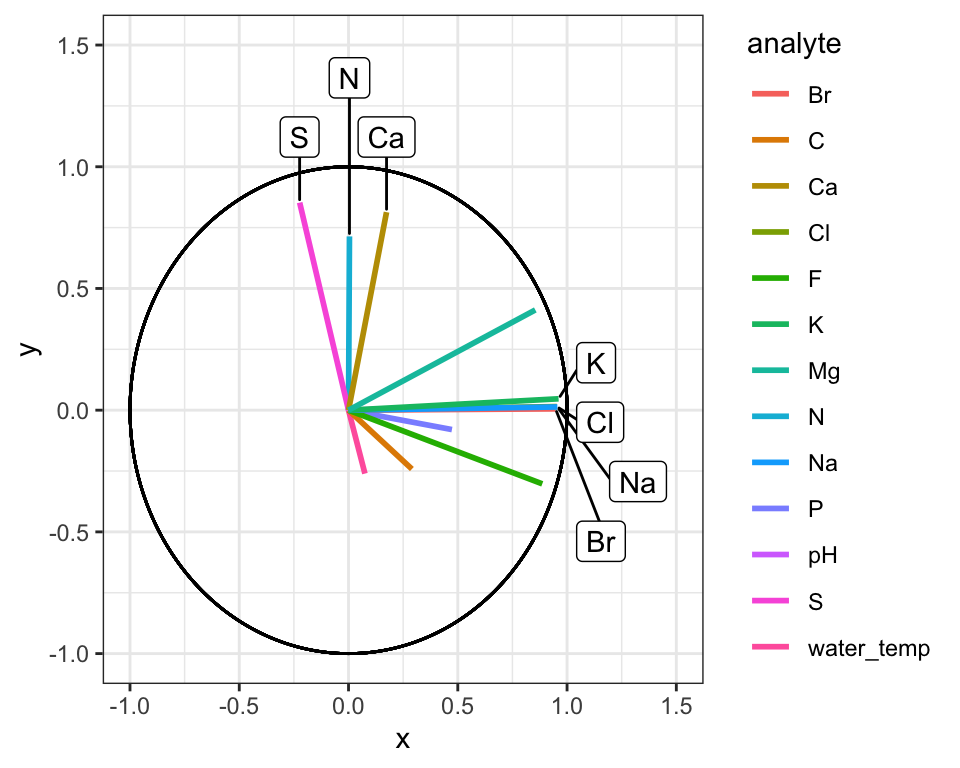

Great! Here is how to read the ordination plot:

1. When considering one analyte's vector: the vector's projected value on an axis shows how much its variance is aligned with that principal component.

2. When considering two analyte vectors: the angle between two vectors indicates how correlated those two variables are. If they point in the same direction, they are highly correlated. If they meet each other at 90 degrees, they are not very correlated. If they meet at ~180 degrees, they are negatively correlated. If say that one analyte is "1.9" with respect to dimension 2 and another is "-1.9" with respect to dimension 2. Let's also say that these vectors are ~"0" with respect to dimension 1.

With the ordination plot above, we can now see that the abundances of K, Cl, Br, and Na are the major contributors of variance to the first principal component (or the first dimension). The abundances of these elements are what make White Fish Lake and North Killeak Lake different from the other lakes. We can also see that the abundances of N, S, and Ca are the major contributors to variance in the second dimension, which means that these elements ar what set Wild Lake, Iniakuk Lake, Walker Lake, and several other lakes in GAAR park apart from the rest of the lakes in the data set. It slightly easier to understand this if we look at an overlay of the two plots, which is often called a "biplot":


```r
AK_lakes_pca <- runMatrixAnalysis(
  data = alaska_lake_data,
  analysis = c("pca"),
  column_w_names_of_multiple_analytes = "element",
  column_w_values_for_multiple_analytes = "mg_per_L",
  columns_w_values_for_single_analyte = c("water_temp", "pH"),
  columns_w_additional_analyte_info = "element_type",
  columns_w_sample_ID_info = c("lake", "park"),
  scale_variance = TRUE
)
## Replacing NAs in your data with mean

AK_lakes_pca_ord <- runMatrixAnalysis(
  data = alaska_lake_data,
  analysis = c("pca_ord"),
  column_w_names_of_multiple_analytes = "element",
  column_w_values_for_multiple_analytes = "mg_per_L",
  columns_w_values_for_single_analyte = c("water_temp", "pH"),
  columns_w_additional_analyte_info = "element_type",
  columns_w_sample_ID_info = c("lake", "park")
)
## Replacing NAs in your data with mean

ggplot() +
  geom_point(
    data = AK_lakes_pca, 
    aes(x = Dim.1, y = Dim.2, fill = park), shape = 21, size = 4, alpha = 0.8
  ) +
  # geom_label_repel(aes(label = lake), alpha = 0.5) +
  geom_segment(
    data = AK_lakes_pca_ord,
    aes(x = 0, y = 0, xend = Dim.1, yend = Dim.2, color = analyte),
    size = 1
  ) +
  scale_color_manual(values = discrete_palette) +
  theme_classic()
```

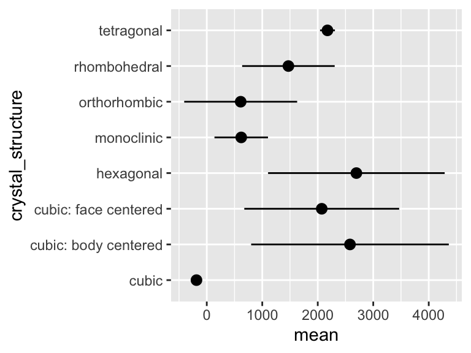

Note that you do not have to plot ordination data as a circular layout of segments. Sometimes it is much easier to plot (and interpret!) alternatives:


```r
AK_lakes_pca_ord %>%
  ggplot(aes(x = Dim.1, y = analyte)) +
    geom_point(aes(fill = analyte), shape = 22, size = 3) +
    scale_fill_manual(values = discrete_palette) +
    theme_bw()
```

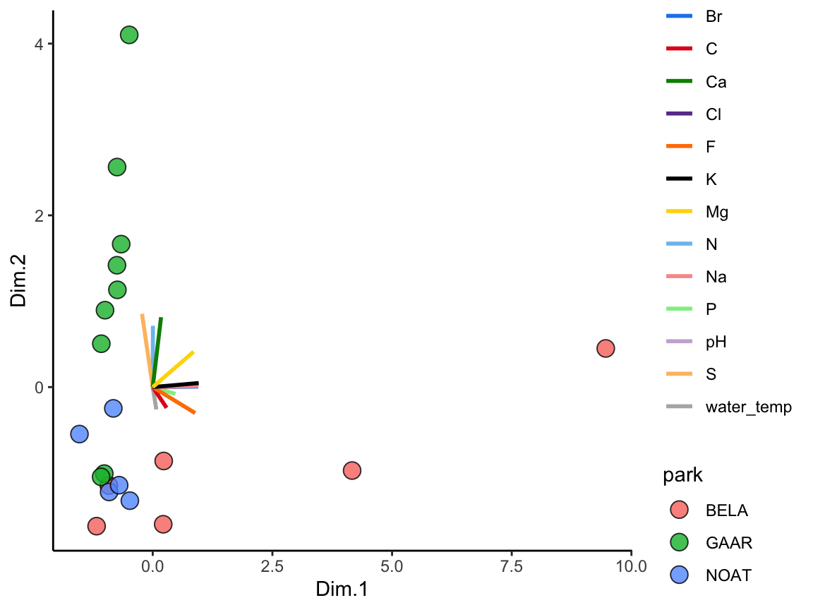

### principal components {-}

We also can access information about the how much of the variance in the data set is explained by each principal component, and we can plot that using ggplot:


```r
AK_lakes_pca_dim <- runMatrixAnalysis(
  data = alaska_lake_data,
  analysis = c("pca_dim"),
  column_w_names_of_multiple_analytes = "element",
  column_w_values_for_multiple_analytes = "mg_per_L",
  columns_w_values_for_single_analyte = c("water_temp", "pH"),
  columns_w_additional_analyte_info = "element_type",
  columns_w_sample_ID_info = c("lake", "park")
)
## Replacing NAs in your data with mean
head(AK_lakes_pca_dim)
## # A tibble: 6 × 2
##   principal_component percent_variance_explained
##                 <dbl>                      <dbl>
## 1                   1                      48.8 
## 2                   2                      18.6 
## 3                   3                      11.6 
## 4                   4                       7.88
## 5                   5                       4.68
## 6                   6                       3.33

ggplot(
  data = AK_lakes_pca_dim, 
  aes(x = principal_component, y = percent_variance_explained)
) +
  geom_line() +
  geom_point() +
  theme_bw()
```


Cool! We can see that the first principal component retains nearly 50% of the variance in the original dataset, while the second dimension contains only about 20%. We can derive an important notion about PCA visualization from this: the scales on the two axes need to be the same for distances between points in the x and y directions to be comparable. This can be accomplished using `coord_fixed()` as an addition to your ggplots.

### exercises {-}

In this set of exercises, as you are filling out the `runMatrixAnalysis()` template, you can use the `colnames()` function to help you specify a long list of column names rather than typing them out by hand. For example, in the periodic table data set, we can refer to a set of columns (columns 10 through 20) with the following command:


```r
colnames(periodic_table_subset)[10:20]
##  [1] "electronegativity_pauling"         
##  [2] "first_ionization_poten_eV"         
##  [3] "second_ionization_poten_eV"        
##  [4] "third_ionization_poten_eV"         
##  [5] "electron_affinity_eV"              
##  [6] "atomic_radius_ang"                 
##  [7] "ionic_radius_ang"                  
##  [8] "covalent_radius_ang"               
##  [9] "atomic_volume_cm3_per_mol"         
## [10] "electrical_conductivity_mho_per_cm"
## [11] "specific_heat_J_per_g_K"
colnames(periodic_table_subset)[c(18:20, 23:25)]
## [1] "atomic_volume_cm3_per_mol"         
## [2] "electrical_conductivity_mho_per_cm"
## [3] "specific_heat_J_per_g_K"           
## [4] "thermal_conductivity_W_per_m_K"    
## [5] "polarizability_A_cubed"            
## [6] "heat_atomization_kJ_per_mol"
```
We can use that command in the template, as in the example below. With the notation `colnames(periodic_table_subset)[c(5:7,9:25)]`, we can mark columns 5 - 7 and 9 - 25 as columns_w_values_for_single_analyte (note what happens when you run `c(5:7,9:25)` in the console, and what happens when you run `colnames(periodic_table_subset)[c(5:7,9:25)]` in the console). With the notation `colnames(periodic_table_subset)[c(1:4, 8)]` we can mark columns 1 - 4 and column 8 as columns_w_sample_ID_info (note what happens when you run `c(1:4, 8)` in the console, and what happens when you run `colnames(periodic_table_subset)[c(1:4, 8)]` in the console).

#### human metabolomics {-}

For these questions, work with a dataset describing metabolomics data (i.e. abundances of > 100 different biochemicals) from each of 93 human patients, some of which have Chronic Kidney Disease. Your task is to discover a biomarker for Chronic Kidney Disease. This means that you will need to determine a metabolite whose abundance is strongly associated with the disease. To do this you should complete the following:

1. Run a PCA analysis on `metabolomics_data` (i.e. `runMatrixAnalysis()` with `analysis = "pca"`)
2. Plot the results of the analysis to determine which principal component (i.e. dimension) separates the healthy and kidney_disease samples.
3. Obtain the ordination plot coordinates for the analytes in the PCA analysis (i.e. `runMatrixAnalysis()` with `analysis = "pca_ord"`). In your own words, how does this plot correspond to the original data set?
4. Visualize the ordination plot and determine which of the analytes are strongly associated with the principal component (i.e. dimension) separates the healthy and kidney_disease samples.
5. Bingo! These analytes are associated with Chronic Kidney Disease and could be biomarkers for such.
6. Complete this PCA analysis by creating a scree plot (i.e. use `analysis = "pca_dim"`). In your own words, what does this plot mean?


#### grape vine chemistry {-}

For this set of quesions, work with a dataset describing metabolomics data (i.e. abundances of > 100 different biochemicals) from 5 different wine grape varieties. Your task is to discover a biomarker for Chardonnay and a biomarker for Cabernet Sauvignon. This means that you will need to identify two metabolites, each of which are associated with one of those two grape varieties. To do this you should complete the following:

1. Run a PCA analysis on `wine_grape_data` (i.e. `runMatrixAnalysis()` with `analysis = "pca"`)
2. Plot the results of the analysis to determine which principal component (i.e. dimension) separates the Chardonnay samples from the other varieties and the Cabernet Sauvignon samples from the other varieties.
3. Obtain the ordination plot coordinates for the analytes in the PCA analysis (i.e. `runMatrixAnalysis()` with `analysis = "pca_ord"`). In your own words, how does this plot correspond to the original data set?
4. Visualize the ordination plot and determine which of the analytes are strongly associated with the principal component (i.e. dimension) separates the Chardonnay samples from the other varieties and the Cabernet Sauvignon samples from the other varieties.
5. Bingo! These analytes are associated with those varieites and could be biomarkers for such.
6. Complete this PCA analysis by creating a scree plot (i.e. use `analysis = "pca_dim"`). In your own words, what does this plot mean?


### further reading {-}

## tsne and umap {-}


```r
set.seed(235)
runMatrixAnalysis(
  data = hops_components,
  analysis = "pca",
  column_w_names_of_multiple_analytes = NULL,
  column_w_values_for_multiple_analytes = NULL,
  columns_w_values_for_single_analyte = colnames(hops_components)[c(5:12)],
  columns_w_additional_analyte_info = NULL,
  columns_w_sample_ID_info = colnames(hops_components)[c(1:4)],
  na_replacement = "mean"
) -> pca_data
pca_data$technique <- "pca_data"
colnames(pca_data) <- gsub("\\.", "_", colnames(pca_data))
pca_data$Dim_1 <- as.numeric(scale(pca_data$Dim_1))
pca_data$Dim_2 <- as.numeric(scale(pca_data$Dim_2))


runMatrixAnalysis(
  data = hops_components,
  analysis = "umap",
  column_w_names_of_multiple_analytes = NULL,
  column_w_values_for_multiple_analytes = NULL,
  columns_w_values_for_single_analyte = colnames(hops_components)[c(5:12)],
  columns_w_additional_analyte_info = NULL,
  columns_w_sample_ID_info = colnames(hops_components)[c(1:4)],
  na_replacement = "mean"
) -> umap_data
umap_data$technique <- "umap_data"
umap_data$Dim_1 <- as.numeric(scale(umap_data$Dim_1))
umap_data$Dim_2 <- as.numeric(scale(umap_data$Dim_2))


runMatrixAnalysis(
  data = hops_components,
  analysis = "tsne",
  column_w_names_of_multiple_analytes = NULL,
  column_w_values_for_multiple_analytes = NULL,
  columns_w_values_for_single_analyte = colnames(hops_components)[c(5:12)],
  columns_w_additional_analyte_info = NULL,
  columns_w_sample_ID_info = colnames(hops_components)[c(1:4)],
  na_replacement = "mean"
) -> tsne_data
tsne_data$technique <- "tsne_data"
tsne_data$Dim_1 <- as.numeric(scale(tsne_data$Dim_1))
tsne_data$Dim_2 <- as.numeric(scale(tsne_data$Dim_2))


data <- rbind(pca_data, umap_data, tsne_data)

p1 <- ggplot(data) +
  geom_point(aes(x = Dim_1, y = Dim_2, fill = hop_origin), shape = 21, size= 4) +
  facet_grid(technique~., scales = "free") +
  scale_fill_brewer(palette = "Set1")

p2 <- ggplot(data) +
  geom_point(aes(x = Dim_1, y = Dim_2, fill = hop_brewing_usage), shape = 21, size= 4) +
  facet_grid(technique~., scales = "free") +
  scale_fill_brewer(palette = "Set1")

p1 + p2
```


### further reading {-}

https://datavizpyr.com/how-to-make-umap-plot-in-r/

https://datavizpyr.com/how-to-make-tsne-plot-in-r/

https://pair-code.github.io/understanding-umap/

https://www.youtube.com/watch?v=jth4kEvJ3P8

<!-- end -->

<!-- start clustering -->
# clustering {-}


## heirarchical clustering {-}

### theory {-}

"Which of my samples are most closely related?"

So far we have been looking at how to plot raw data, summarize data, and reduce a data set's dimensionality. It's time to look at how to identify relationships between the samples in our data sets. For example: in the Alaska lakes dataset, which lake is most similar, chemically speaking, to Lake Narvakrak? Answering this requires calculating numeric distances between samples based on their chemical properties. For this, the first thing we need is a distance matrix:


Please note that we can get distance matrices directly from `runMatrixAnalysis` by specifying `analysis = "dist"`:


```r
dist <- runMatrixAnalysis(
    data = alaska_lake_data,
    analysis = c("dist"),
    column_w_names_of_multiple_analytes = "element",
    column_w_values_for_multiple_analytes = "mg_per_L",
    columns_w_values_for_single_analyte = c("water_temp", "pH"),
    columns_w_additional_analyte_info = "element_type",
    columns_w_sample_ID_info = c("lake", "park")
)
## Replacing NAs in your data with mean

as.matrix(dist)[1:3,1:3]
##                          Devil_Mountain_Lake_BELA
## Devil_Mountain_Lake_BELA                 0.000000
## Imuruk_Lake_BELA                         3.672034
## Kuzitrin_Lake_BELA                       1.663147
##                          Imuruk_Lake_BELA
## Devil_Mountain_Lake_BELA         3.672034
## Imuruk_Lake_BELA                 0.000000
## Kuzitrin_Lake_BELA               3.062381
##                          Kuzitrin_Lake_BELA
## Devil_Mountain_Lake_BELA           1.663147
## Imuruk_Lake_BELA                   3.062381
## Kuzitrin_Lake_BELA                 0.000000
```

There is more that we can do with distance matrices though, lots more. Let's start by looking at an example of hierarchical clustering. For this, we just need to tell `runMatrixAnalysis()` to use `analysis = "hclust"`: 


```r
AK_lakes_clustered <- runMatrixAnalysis(
    data = alaska_lake_data,
    analysis = "hclust",
    column_w_names_of_multiple_analytes = "element",
    column_w_values_for_multiple_analytes = "mg_per_L",
    columns_w_values_for_single_analyte = c("water_temp", "pH"),
    columns_w_additional_analyte_info = "element_type",
    columns_w_sample_ID_info = c("lake", "park"),
    na_replacement = "mean"
)
## Replacing NAs in your data with mean
AK_lakes_clustered
## # A tibble: 39 × 25
##    sample_unique_ID   lake  park  parent  node branch.length
##    <chr>              <chr> <chr>  <int> <int>         <dbl>
##  1 Devil_Mountain_La… Devi… BELA      33     1         0.987
##  2 Imuruk_Lake_BELA   Imur… BELA      39     2         0.820
##  3 Kuzitrin_Lake_BELA Kuzi… BELA      38     3         0.703
##  4 Lava_Lake_BELA     Lava… BELA      31     4         0.743
##  5 North_Killeak_Lak… Nort… BELA      21     5         5.62 
##  6 White_Fish_Lake_B… Whit… BELA      22     6         3.89 
##  7 Iniakuk_Lake_GAAR  Inia… GAAR      28     7         1.25 
##  8 Kurupa_Lake_GAAR   Kuru… GAAR      35     8         0.954
##  9 Lake_Matcharak_GA… Lake… GAAR      35     9         0.954
## 10 Lake_Selby_GAAR    Lake… GAAR      36    10         1.12 
## # … with 29 more rows, and 19 more variables: label <chr>,
## #   isTip <lgl>, x <dbl>, y <dbl>, branch <dbl>,
## #   angle <dbl>, water_temp <dbl>, pH <dbl>, C <dbl>,
## #   N <dbl>, P <dbl>, Cl <dbl>, S <dbl>, F <dbl>, Br <dbl>,
## #   Na <dbl>, K <dbl>, Ca <dbl>, Mg <dbl>
```

It works! Now we can plot our cluster diagram with a ggplot add-on called ggtree. We've seen that ggplot takes a "data" argument (i.e. `ggplot(data = <some_data>) + geom_*()` etc.). In contrast, ggtree takes an argument called `tr`, though if you're using the `runMatrixAnalysis()` function, you can treat these two (`data` and `tr`) the same, so, use: `ggtree(tr = <output_from_runMatrixAnalysis>) + geom_*()` etc.

Note that `ggtree` also comes with several great new geoms: `geom_tiplab()` and `geom_tippoint()`. Let's try those out:


```r
library(ggtree)
AK_lakes_clustered %>%
ggtree() +
  geom_tiplab() +
  geom_tippoint() +
  theme_classic()
```

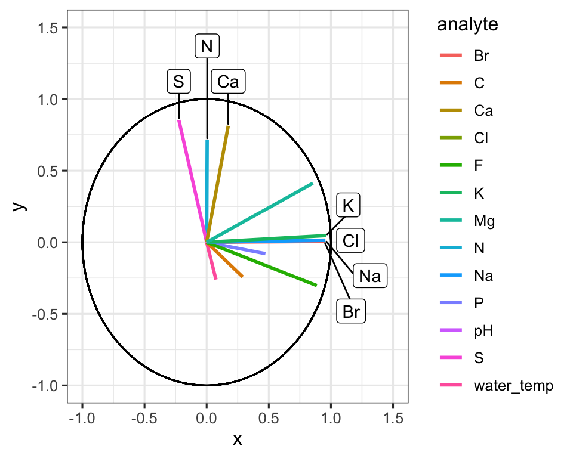

Cool! Though that plot could use some tweaking... let's try:


```r
AK_lakes_clustered %>%
ggtree() +
    geom_tiplab(aes(label = lake), offset = 1, align = TRUE) +
    geom_tippoint(shape = 21, aes(fill = park), size = 4) +
    scale_x_continuous(limits = c(0,10)) +
    scale_fill_brewer(palette = "Set1") +
    # theme_classic() +
    theme(
      legend.position = c(0.2,0.8)
    )
```

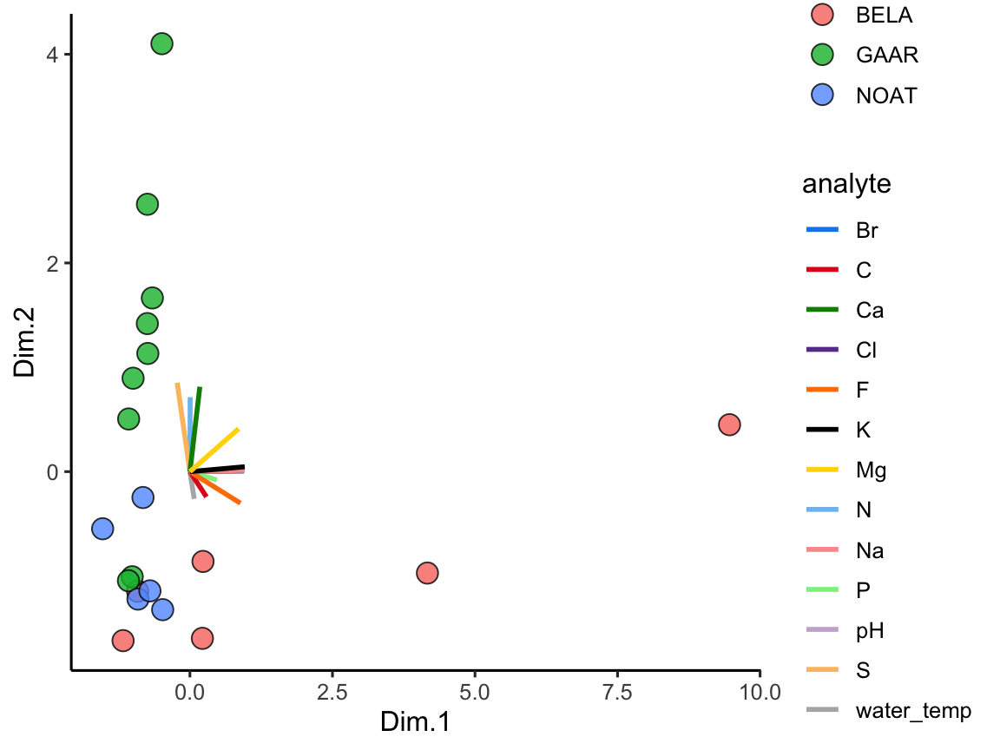

Very nice!

### further reading {-}
 
For more information on plotting annotated trees, see: https://yulab-smu.top/treedata-book/chapter10.html.

For more on clustering, see: https://ryanwingate.com/intro-to-machine-learning/unsupervised/hierarchical-and-density-based-clustering/.

### exercises {-}

For this set of exercises, please use `runMatrixAnalysis()` to run and visualize a hierarchical cluster analysis with each of the main datasets that we have worked with so far, except for NY_trees. This means: `algae_data` (which algae strains are most similar to each other?), `alaska_lake_data` (which lakes are most similar to each other?). and `solvents` (which solvents are most similar to each other?). It also means you should use the periodic table (which elements are most similar to each other?), though please don't use the whole periodic table, rather, use `periodic_table_subset`. Please also conduct a heirarchical clustering analysis for a dataset of your own choice that is not provided by the `source()` code. For each of these, create (i) a tree diagram that shows how the "samples" in each data set are related to each other based on the numerical data associated with them, (ii) a caption for each diagram, and (iii) describe, in two or so sentences, an interesting trend you see in the diagram. You can ignore columns that contain categorical data, or you can list those columns as "additional_analyte_info".

For this assignment, you may again find the `colnames()` function and square bracket-subsetting useful. It will list all or a subset of the column names in a dataset for you. For example:


```r
colnames(solvents)
##  [1] "solvent"             "formula"            
##  [3] "boiling_point"       "melting_point"      
##  [5] "density"             "miscible_with_water"
##  [7] "solubility_in_water" "relative_polarity"  
##  [9] "vapor_pressure"      "CAS_number"         
## [11] "formula_weight"      "refractive_index"   
## [13] "specific_gravity"    "category"

colnames(solvents)[1:3]
## [1] "solvent"       "formula"       "boiling_point"

colnames(solvents)[c(1,5,7)]
## [1] "solvent"             "density"            
## [3] "solubility_in_water"
```

## k-means and dbscan {-}

"Do my samples fall into definable clusters?"

### theory {-}

One of the questions we've been asking is "which of my samples are most closely related?". We've been answering that question using clustering. However, now that we know how to run principal components analyses, we can use another approach. This alternative approach is called k-means, and can help us decide how to assign our data into clusters. It is generally desirable to have a small number of clusters, however, this must be balanced by not having the variance within each cluster be too big. To strike this balance point, the elbow method is used. For it, we must first determine the maximum within-group variance at each possible number of clusters. An illustration of this is shown in **A** below:


One we know within-group variances, we find the "elbow" point - the point with minimum angle theta - thus picking the outcome with a good balance of cluster number and within-cluster variance (illustrated above in **B** and **C**.)

Let's try k-means using `runMatrixAnalysis`. For this example, let's run it on the PCA projection of the alaska lakes data set. We can set `analysis = "kmeans"`. When we do this, an application will load that will show us the threshold value for the number of clusters we want. We set the number of clusters and then close the app. In the context of markdown document, simply provide the number of clusters to the `parameters` argument:


```r
alaska_lake_data_pca <- runMatrixAnalysis(
    data = alaska_lake_data,
    analysis = c("pca"),
    column_w_names_of_multiple_analytes = "element",
    column_w_values_for_multiple_analytes = "mg_per_L",
    columns_w_values_for_single_analyte = c("water_temp", "pH"),
    columns_w_additional_analyte_info = "element_type",
    columns_w_sample_ID_info = c("lake", "park")
)
## Replacing NAs in your data with mean

alaska_lake_data_pca_clusters <- runMatrixAnalysis(
    data = alaska_lake_data_pca,
    analysis = c("kmeans"),
    parameters = c(5),
    column_w_names_of_multiple_analytes = NULL,
    column_w_values_for_multiple_analytes = NULL,
    columns_w_values_for_single_analyte = c("Dim.1", "Dim.2"),
    columns_w_sample_ID_info = "sample_unique_ID"
)
## Using 5 as a value for cluster_number.

alaska_lake_data_pca_clusters <- left_join(alaska_lake_data_pca_clusters, alaska_lake_data_pca) 
```

We can plot the results and color them according to the group that kmeans suggested. We can also highlight groups using `geom_mark_ellipse`. Note that it is recommended to specify both `fill` and `label` for geom_mark_ellipse:


```r
alaska_lake_data_pca_clusters$cluster <- factor(alaska_lake_data_pca_clusters$cluster)
ggplot() +
  geom_point(
    data = alaska_lake_data_pca_clusters,
    aes(x = Dim.1, y = Dim.2, fill = cluster), shape = 21, size = 5, alpha = 0.6
  ) +
  geom_mark_ellipse(
    data = alaska_lake_data_pca_clusters,
    aes(x = Dim.1, y = Dim.2, label = cluster, fill = cluster), alpha = 0.2
  ) +
  theme_classic() +
  coord_cartesian(xlim = c(-7,12), ylim = c(-4,5)) +
  scale_fill_manual(values = discrete_palette) 
```


There is another method to define clusters that we call dbscan. In this method, not all points are necessarily assigned to a cluster, and we define clusters according to a set of parameters, instead of simply defining the number of clusteres, as in kmeans. In interactive mode, `runMatrixAnalysis()` will again load an interactive means of selecting parameters for defining dbscan clusters ("k", and "threshold"). In the context of markdown document, simply provide "k" and "threshold" to the `parameters` argument:


```r
alaska_lake_data_pca <- runMatrixAnalysis(
    data = alaska_lake_data,
    analysis = c("pca"),
    column_w_names_of_multiple_analytes = "element",
    column_w_values_for_multiple_analytes = "mg_per_L",
    columns_w_values_for_single_analyte = c("water_temp", "pH"),
    columns_w_additional_analyte_info = "element_type",
    columns_w_sample_ID_info = c("lake", "park")
) 
## Replacing NAs in your data with mean

alaska_lake_data_pca_clusters <- runMatrixAnalysis(
    data = alaska_lake_data_pca,
    analysis = c("dbscan"),
    parameters = c(4, 0.45),
    column_w_names_of_multiple_analytes = NULL,
    column_w_values_for_multiple_analytes = NULL,
    columns_w_values_for_single_analyte = c("Dim.1", "Dim.2"),
    columns_w_sample_ID_info = "sample_unique_ID"
)
## Using 4 as a value for k.
## Using 0.45 as a value for threshold.

alaska_lake_data_pca_clusters <- left_join(alaska_lake_data_pca_clusters, alaska_lake_data_pca)
```
We can make the plot in the same way, but please note that to get `geom_mark_ellipse` to omit the ellipse for NAs you need to feed it data without NAs:


```r
alaska_lake_data_pca_clusters$cluster <- factor(alaska_lake_data_pca_clusters$cluster)
ggplot() +
  geom_point(
    data = alaska_lake_data_pca_clusters,
    aes(x = Dim.1, y = Dim.2, fill = cluster), shape = 21, size = 5, alpha = 0.6
  ) +
  geom_mark_ellipse(
    data = drop_na(alaska_lake_data_pca_clusters),
    aes(x = Dim.1, y = Dim.2, label = cluster, fill = cluster), alpha = 0.2
  ) +
  theme_classic() +
  coord_cartesian(xlim = c(-7,12), ylim = c(-4,5)) +
  scale_fill_manual(values = discrete_palette) 
```


### summarize by cluster {-}

One more important point: when using kmeans or dbscan, we can use the clusters as groupings for summary statistics. For example, suppose we want to see the differences in abundances of certain chemicals among the clusters:


```r
alaska_lake_data_pca <- runMatrixAnalysis(
  data = alaska_lake_data,
  analysis = c("pca"),
  column_w_names_of_multiple_analytes = "element",
  column_w_values_for_multiple_analytes = "mg_per_L",
  columns_w_values_for_single_analyte = c("water_temp", "pH"),
  columns_w_additional_analyte_info = "element_type",
  columns_w_sample_ID_info = c("lake", "park")
)
## Replacing NAs in your data with mean

alaska_lake_data_pca_clusters <- runMatrixAnalysis(
  data = alaska_lake_data_pca,
  analysis = c("dbscan"),
  parameters = c(4, 0.45),
  column_w_names_of_multiple_analytes = NULL,
  column_w_values_for_multiple_analytes = NULL,
  columns_w_values_for_single_analyte = c("Dim.1", "Dim.2"),
  columns_w_sample_ID_info = "sample_unique_ID",
  columns_w_additional_analyte_info = colnames(alaska_lake_data_pca)[6:18]
) 
## Using 4 as a value for k.
## Using 0.45 as a value for threshold.

alaska_lake_data_pca_clusters <- left_join(alaska_lake_data_pca_clusters, alaska_lake_data_pca)

alaska_lake_data_pca_clusters %>%
  select(cluster, S, Ca) %>%
  pivot_longer(cols = c(2,3), names_to = "analyte", values_to = "mg_per_L") %>%
  drop_na() %>%
  group_by(cluster, analyte) -> alaska_lake_data_pca_clusters_clean

plot_2 <- ggplot() + 
  geom_col(
    data = summarize(
      alaska_lake_data_pca_clusters_clean,
      mean = mean(mg_per_L), sd = sd(mg_per_L)
    ),
    aes(x = cluster, y = mean, fill = cluster),
    color = "black", alpha = 0.6
  ) +
  geom_errorbar(
    data = summarize(
      alaska_lake_data_pca_clusters_clean,
      mean = mean(mg_per_L), sd = sd(mg_per_L)
    ),
    aes(x = cluster, ymin = mean-sd, ymax = mean+sd, fill = cluster),
    color = "black", alpha = 0.6, width = 0.5, size = 1
  ) +
  facet_grid(.~analyte) + theme_bw() +
  geom_jitter(
    data = alaska_lake_data_pca_clusters_clean,
    aes(x = cluster, y = mg_per_L, fill = cluster), width = 0.05,
    shape = 21
  ) +
  scale_fill_manual(values = discrete_palette) 

plot_1<- ggplot() +
  geom_point(
    data = alaska_lake_data_pca_clusters,
    aes(x = Dim.1, y = Dim.2, fill = cluster), shape = 21, size = 5, alpha = 0.6
  ) +
  geom_mark_ellipse(
    data = drop_na(alaska_lake_data_pca_clusters),
    aes(x = Dim.1, y = Dim.2, label = cluster, fill = cluster), alpha = 0.2
  ) +
  theme_classic() + coord_cartesian(xlim = c(-7,12), ylim = c(-4,5)) +
  scale_fill_manual(values = discrete_palette)

plot_1 + plot_2
```

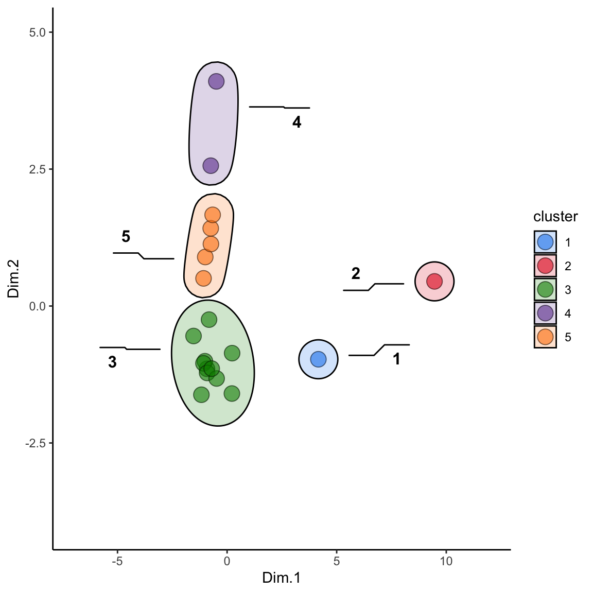
 
### further reading {-}

http://www.sthda.com/english/wiki/wiki.php?id_contents=7940

https://ryanwingate.com/intro-to-machine-learning/unsupervised/hierarchical-and-density-based-clustering/

https://ryanwingate.com/intro-to-machine-learning/unsupervised/hierarchical-and-density-based-clustering/hierarchical-4.png

https://www.geeksforgeeks.org/dbscan-clustering-in-r-programming/


### exercises {-}

For this set of exercises, please use the dataset `hawaii_aquifers`, available after you run the `source()` command. Do the following:

1. Run a PCA analysis on the data set and plot the results. 

2.  Create an ordination plot and identify one analyte that varies with Dim.1 and one analyte that varies with Dim.2 (these are your "variables of interest").

3. Run kmeans clustering on your PCA output. Create a set of clusters that seems to appropriately subdivide the data set.

4. Use the clusters defined by kmeans as groupings on which to run summary statistics for your two variables of interest.

5. Create a plot with four subpanels that shows: (i) the PCA analysis (colored by kmeans clusters), (ii) the ordination analysis, and (iii) the summary statistics for your two variables of interest within the kmeans groups. Please note that subpanel plots can be created by sending ggplots to their own objects and then adding those objects together. Please see the subsection in the data visualization chapter on subplots.

6. Run dbscan clustering on your PCA output. Create a set of clusters that seems to appropriately subdivide the data set.

7. Use the clusters defined by dbscan as groupings on which to run summary statistics for your two variables of interest.

8. Create a plot with four subpanels that shows: (i) the PCA analysis (colored by dbscan clusters), (ii) the ordination analysis, and (iii) the summary statistics for your two variables of interest within the dbscan groups.


<!-- 


* Question 1

Run a principal components analysis on the dataset. Use `na_replacement = "drop"` (so that variables with NA values are not included in the analysis) and generate clusters automatically using kmeans by setting `kmeans = "auto"`. Make scatter plot of the results. How many clusters does kmeans recommend? 


* Question 2

Modify your code from Question 1 so that only two clusters are generated. Plot the results. Use `geom_mark_ellipse` to highlight each cluster in your plot (note that the `fill` aesthetic is required to mark groups). Which varieties are put into each of the two clusters?


* Question 3

Use an ordination plot to determine what chemicals makes Chardonnay so different from the other varieties. To what class of compounds do these chemical belong?


* Question 4

Modify your code from Question 2 so that five clusters are generated. Plot the results. Use `geom_mark_ellipse` to highlight each cluster in your plot (note that the `fill` aesthetic is required to mark groups). Based on this plot, which grape variety undergoes the least amount of change, chemically speaking, between dry and well-watered conditions?


* Question 5

Run a heirarchical clustering analysis on the wine grapes data set, using kmeans to create five groups, and also continue using `na_replacement = "drop"`. Plot the results. Which grape variety undergoes the most change in terms of its chemistry between well-watered and dry conditions? (hint: remember that the x-axis shows the distances between nodes and tips, the y-axis is meaningless). Compare the method you used to compare sample shifts in question 4 (i.e. pca+kmeans) versus the method you used in this question (i.e. hclust+kmeans). Which do you is better? Would this change depending on the circumstances?


* Question 6

Google "Quercetin". What kind of compound is it? Use the clusters created by the heirarchical clustering analysis in question 5 as groups for which to calculate summary statistics. Calculate the mean and standard deviation of the concentration of Quercetin in each group. Plot the result using `geom_pointrange` and adjust axis font sizes so that they are in good proportion with the size of the plot. Also specify a theme (for example, `theme_classic()`).

Does one cluster have a large amount of variation in Quercetin abundance? Why do you think this might be?


* Question 7

Use `cowplot::plot_grid` to display your plots from questions 4 and 5 next to each other.


* Challenge (optional)

Use cowplot to display your plots from questions 4, 5, and 6 alongside each other. **Make your combined plot as attractive as possible!** Use each of the following:

`align = TRUE` inside `geom_tiplab()`

`nrow = 1` inside `plot_grid()`

`rel_widths = <your_choice>` inside `plot_grid()`

`name = <your_choice>` inside `scale_*_*`

`label = cluster` inside `geom_mark_ellipse()`

`breaks = <your_choice>` inside `scale_x_continuous()` or `scale_y_continuous()` (as an example, `breaks = seq(0,10,1)`)

Also, consider using:

`guides(fill = "none", color = "none")`

Install the RColorBrewer package, and use one of its color schemes. As an example with the color scheme `Set1`:

`scale_fill_brewer(palette = "Set1", na.value = "grey")`

`scale_color_brewer(palette = "Set1", na.value = "grey")`

Save your plot as a png using `ggsave()`.


Maybe something like this:

{r fig.align='center', echo=FALSE, include=identical(knitr:::pandoc_to(), 'html'), results="markup"}
knitr:::include_graphics('https://thebustalab.github.io/integrated_bioanalytics/images/Ex6Challenge.png', dpi = NA)
 -->

<!-- end -->

<!-- start models -->

# models {-}

## theory {-}

Next on our quest to develop our abilities in analytical data exploration is modeling. We will start with some of the simplest models - linear models. There are a variety of ways to build linear models in R, but we will use a function called `buildLinearModel`. To use it, we simply give it our data, and tell it which to sets of values we want to compare. To tell it what we want to compare, we give it a formula in the form of Y = M x X + B, however, the B term and the M are implicit, so all we need to tell it is Y = X.

Let's look at an example. Suppose we want to know if the abundances of ADP and AMP are related in our metabolomics dataset:


```r
ggplot(metabolomics_data) +
  geom_point(aes(x = AMP, y = ADP))
```


It looks like there might be a relationship! Let's build a linear model for that relationship:


```r
model <- buildLinearModel(
  data = metabolomics_data,
  formula = "ADP = AMP"
)
str(model, strict.width = "cut")
## List of 2
##  $ metrics:'data.frame':	6 obs. of  4 variables:
##   ..$ variable: chr [1:6] "(Intercept)" "AMP" "median_res"..
##   ..$ value   : num [1:6] 0.7842 0.9142 0.0415 40.3224 15...
##   ..$ type    : chr [1:6] "coefficient" "coefficient" "st"..
##   ..$ p_value : chr [1:6] "0.4375" "0" NA NA ...
##  $ data   :'data.frame':	92 obs. of  7 variables:
##   ..$ input_x  : num [1:92] 13.2 13.5 14.3 13.3 12 ...
##   ..$ input_y  : num [1:92] 12.8 13.1 13.3 13.2 11.9 ...
##   ..$ ADP      : num [1:92] 12.8 13.1 13.3 13.2 11.9 ...
##   ..$ AMP      : num [1:92] 13.2 13.5 14.3 13.3 12 ...
##   ..$ residuals: num [1:92] 0.0312 -0.0217 -0.6014 0.2458 ..
##   ..$ model_y  : num [1:92] 12.8 13.1 13.9 13 11.8 ...
##   ..$ model_x  : num [1:92] 13.2 13.5 14.3 13.3 12 ...
```
The model consists of two thigs: metrics and data. Let's look at the metrics:


```r
model$metrics
##               variable   value        type p_value
## 1          (Intercept)  0.7842 coefficient  0.4375
## 2                  AMP  0.9142 coefficient       0
## 3      median_residual  0.0415   statistic    <NA>
## 4    total_sum_squares 40.3224   statistic    <NA>
## 5 residual_sum_squares 15.3901   statistic    <NA>
## 6            r_squared  0.6183   statistic    <NA>
```

It shows us the intercept (b), the variable for AMP (i.e. the slope, m), as well some other things (we will talk about them in a second). The other thing the model contains is the data (below). This includes the input_x and y values. The raw values for ADP and AMP, the residuals (see below for details), and the x and y values generated by the model.


```r
head(model$data)
##    input_x  input_y      ADP      AMP   residuals  model_y
## 1 13.15029 12.83791 12.83791 13.15029  0.03119000 12.80672
## 2 13.48362 13.08980 13.08980 13.48362 -0.02165141 13.11146
## 3 14.32515 13.27943 13.27943 14.32515 -0.60138528 13.88082
## 4 13.31191 13.20029 13.20029 13.31191  0.24581244 12.95448
## 5 11.99764 11.93350 11.93350 11.99764  0.18057517 11.75293
## 6 12.95966 12.83649 12.83649 12.95966  0.20405638 12.63243
##    model_x
## 1 13.15029
## 2 13.48362
## 3 14.32515
## 4 13.31191
## 5 11.99764
## 6 12.95966
```

Let's plot the model!


```r
ggplot(model$data) +
  geom_point(aes(x = input_x, y = input_y)) +
  geom_line(aes(x = model_x, y = model_y))
```


Very good. Now let's talk about evaluating the quality of our model. For this we need some means of assessing how well our line fits our data. We will use residuals - the distance between each of our points and our line.


```r
ggplot(model$data) +
  geom_point(aes(x = input_x, y = input_y)) +
  geom_line(aes(x = model_x, y = model_y)) +
  geom_segment(aes(x = input_x, y = input_y, xend = input_x, yend = model_y))
```


We can calculate the sum of the squared residuals:


```r
sum(
  (model$data$input_y - model$data$model_y)^2
, na.rm = TRUE)
## [1] 15.39014
```

15.39! Let's call that the "residual sum of the squares". So. 15.39.. does that mean our model is good? I don't know. We have to compare that number to something. Let's compare it to a super simple model that is just defined by the mean y value of the input data.


```r
ggplot(metabolomics_data) +
  geom_point(aes(x = AMP, y = ADP)) +
  geom_hline(aes(yintercept = mean(ADP, na.rm = TRUE)))
```


A pretty bad model, I agree. How much better is our linear model that the flat line model? Let's create a measure of the distance between each point and the point predicted for that same x value on the model:


```r
sum(
  (metabolomics_data$ADP - mean(metabolomics_data$ADP, na.rm = TRUE))^2
, na.rm = TRUE)
## [1] 40.32239

ggplot(metabolomics_data) +
  geom_point(aes(x = AMP, y = ADP)) +
  geom_hline(aes(yintercept = mean(ADP, na.rm = TRUE))) +
  geom_segment(aes(x = AMP, y = ADP, xend = AMP, yend = mean(ADP, na.rm = TRUE)))
```

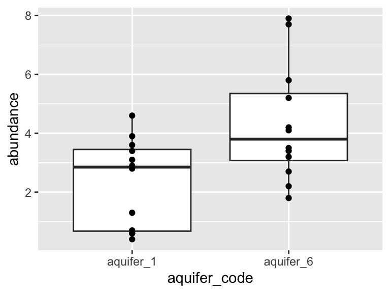

40.32! Wow. Let's call that the "total sum of the squares", and now we can compare that to our "residual sum of the squares": 


```r
1-(15.39/40.32)
## [1] 0.6183036
```

0.68! Alright. That is our R squared value. It is equal to 1 minus the ratio of the "residual sum of the squares" to the "total sum of the squares". Now, let's put it all together and make it pretty:


```r
top <- ggplot(model$data) +
  geom_point(aes(x = input_x, y = input_y)) +
  geom_line(aes(x = model_x, y = model_y)) +
  annotate(geom = "table",
    x = 11.4,
    y = 16,
    label = list(model$metrics)
  ) +
  coord_cartesian(ylim = c(10,16)) +
  theme_bw()

bottom <- ggplot(model$data) +
  geom_col(
    aes(x = input_x, y = residuals),
    width = 0.03, color = "black", position = "dodge", alpha = 0.5
  ) +
  theme_bw()

cowplot::plot_grid(top, bottom, ncol = 1, labels = "AUTO", rel_heights = c(2,1))
```


## exercises {-}

To practice creating linear models, try the following:

1. Choose one of the datasets we have used so far, and run a principal components analysis on it. Note that the output of the analysis when you run "pca_ord" contains the Dimension 1 coordinate "Dim.1" for each sample, as well as the abundance of each analyte in that sample.

2. Using the information from the ordination plot, identify two analytes: one that has a variance that is strongly and positively correlated with the first principal component (i.e. dimension 1), and one that has a variance that is slightly less strongly, but still positively correlated with the first principal component. Using `buildLinearModel`, create and plot two linear models, one that regresses each of those analytes against dimension 1. Which has the greater r-squared value? Based on what you know about PCA, does that make sense?

3. Choose two analytes: one should be one of the analytes from question 2 above, the other should be an analyte that, according to your PCA ordination analysis, is negatively correlated with the first principal component. Using `buildLinearModel` create plots showing how those two analytes are correlated with dimension 1. One should be positively correlated, and the other negatively correlated. Enhance the plots by including in them a visual represetation of the residuals.


## further reading {-}

https://github.com/easystats/performance

<!-- end -->

<!-- start comparing means -->

# comparing means {-}


**"Are these two things the same?"**

Often, we want to know if our study subjects contain different amounts of certain analytes. For example, "Does this lake over here contain more potassium than that lake over there?" For this, we need statistical tests. Here, we will have a look at comparing mean values for analyte abundance in situations with two samples and in situations with more than two samples.

I find many of the concepts discussed in this chapter easier to think about with an example in mind. For that, suppose that you are an analytical chemist on Hawaii that is studying the chemistry of the island's aquifers. you have the data set `hawaii_aquifers`. You can see in the output below the structure of the data set - we have 990 measurements of a 9 different analytes in multiple wells that draw on a set of 10 aquifers.


```r
hawaii_aquifers
## # A tibble: 954 × 6
##    aquifer_code well_name         longitude latitude analyte
##    <chr>        <chr>                 <dbl>    <dbl> <chr>  
##  1 aquifer_1    Alewa_Heights_Sp…        NA       NA SiO2   
##  2 aquifer_1    Alewa_Heights_Sp…        NA       NA Cl     
##  3 aquifer_1    Alewa_Heights_Sp…        NA       NA Mg     
##  4 aquifer_1    Alewa_Heights_Sp…        NA       NA Na     
##  5 aquifer_1    Alewa_Heights_Sp…        NA       NA K      
##  6 aquifer_1    Alewa_Heights_Sp…        NA       NA SO4    
##  7 aquifer_1    Alewa_Heights_Sp…        NA       NA HCO3   
##  8 aquifer_1    Alewa_Heights_Sp…        NA       NA dissol…
##  9 aquifer_1    Alewa_Heights_Sp…        NA       NA Ca     
## 10 aquifer_1    Beretania_High_S…        NA       NA SiO2   
## # … with 944 more rows, and 1 more variable:
## #   abundance <dbl>
unique(hawaii_aquifers$aquifer_code)
##  [1] "aquifer_1"  "aquifer_2"  "aquifer_3"  "aquifer_4" 
##  [5] "aquifer_5"  "aquifer_6"  "aquifer_7"  "aquifer_8" 
##  [9] "aquifer_9"  "aquifer_10"
```
Importantly, there are many wells that draw on each aquifer, as shown in the graph below.


```r
hawaii_aquifers %>%
  select(aquifer_code, well_name) %>%
  group_by(aquifer_code) %>%
  summarize(n_wells = length(unique(well_name))) -> aquifers_summarized

aquifers_summarized
## # A tibble: 10 × 2
##    aquifer_code n_wells
##    <chr>          <int>
##  1 aquifer_1         12
##  2 aquifer_10         7
##  3 aquifer_2          5
##  4 aquifer_3          3
##  5 aquifer_4         16
##  6 aquifer_5          4
##  7 aquifer_6         12
##  8 aquifer_7          9
##  9 aquifer_8          3
## 10 aquifer_9         30

ggplot(aquifers_summarized) + geom_col(aes(x = n_wells, y = aquifer_code))
```


<!-- To run these statistical analyses, we will need several new R packages: `rstatix`, `agricolae`, and `multcompView`. Please install these with `install.packages("rstatix")`, `install.packages("agricolae")`, and `install.packages("multcompView")`. Load them into your R session using `library(rstatix)`, `library(agricolae)`, and `library(multcompView)`.
 -->
<!-- ```{r, echo = FALSE, message = FALSE}
source("https://thebustalab.github.io/phylochemistry/phylochemistry.R")
library(rstatix)
library(agricolae)
library(multcompView)
``` -->

## definitions {-}

1. **populations and independent measurements**: When we are comparing means, we are comparing two *sets* of values. It is important to consider where these values came from in the first place. In particular, it is usually useful to think of these values as representatives of larger populations. In the example of our aquifer data set, we can think of the measurements from different wells drawing on the same aquifer as independent measurements of the "population" (i.e. the aquifer).

2. **the null hypothesis**: When we conduct a statistical test, we are testing the null hypothesis. The null (think "default") hypothesis is that there is no difference bewteen the means (hence the name "null"). In the example of our aquifers, let's say that we're interested in whether two aquifers have different abundances of potassium - in this case the null hypothesis is that they do not differ, in other words, that they have the same amount of potassium.

3. **the *p* value**: The *p* value represents the probability of getting data as extreme as our results if the null hypothesis is true. In other words - the *p* value is the probability that we would observe the differences we did, if in fact there were no differences in the means at all. To continue with our example: suppose we measure potassium levels in 10% of the wells that access each aquifer and find that aquifer_1 has potassium levels of 14 +/- 2 and aquifer_2 has potassium levels of 12 +/- 1. Suppose that we then conduct a statistical test and get a p value of 0.04. This means that, assuming the aquifers have the same magneisum levels (i.e. assuming the null hypothesis is true), there is a 4% chance that we would get the measured values that we did. In other words, IF the aquifers have the same potassium abundance, it is pretty unlikely that we would have obtained the measurements that we did.

Please note that the the *p* value is not the probability of a detected difference being a false positive. The probability of a false positive requires additional information in order to be calculated. For further discussion please see the end of this chapter.

## test selection {-}

There are many different types of statistical tests. Below is a flow chart illustrating how it is recommended that statistical tests be used in this course. You can see that there are three regimes of tests: variance and normality tests (blue), parametric tests (green), and non-parametric tests (orange):


When we are comparing means, we need to first determine what kind of statistical tests we can use with our data. If (i) our data can be reasonably modelled by a normal distribution and (ii) the variances about the two means are similar, then we can use the more powerful "parametric" tests (i.e. tests that will be more likely to detect a difference in means, assuming one exists). If one of these criteria are not met, then we need to use less powerful "non-parametric" tests.

We can check our data for normality and similar variances using the Shapiro test and the Levene test. Let's use the `hawaii_aquifers` data as an example, and let's consider only the element potassium:


```r
K_data <- hawaii_aquifers %>%
  filter(analyte == "K")
  K_data
## # A tibble: 106 × 6
##    aquifer_code well_name         longitude latitude analyte
##    <chr>        <chr>                 <dbl>    <dbl> <chr>  
##  1 aquifer_1    Alewa_Heights_Sp…       NA      NA   K      
##  2 aquifer_1    Beretania_High_S…       NA      NA   K      
##  3 aquifer_1    Beretania_Low_Se…       NA      NA   K      
##  4 aquifer_1    Kuliouou_Well         -158.     21.3 K      
##  5 aquifer_1    Manoa_Well_II         -158.     21.3 K      
##  6 aquifer_1    Moanalua_Wells_P…     -158.     21.4 K      
##  7 aquifer_1    Moanalua_Wells_P…     -158.     21.4 K      
##  8 aquifer_1    Moanalua_Wells_P…     -158.     21.4 K      
##  9 aquifer_1    Nuuanu_Aerator_W…     -158.     21.4 K      
## 10 aquifer_1    Palolo_Tunnel         -158.     21.3 K      
## # … with 96 more rows, and 1 more variable: abundance <dbl>
```

To work with two means, let's just look at aquifers 1 and 6:


```r
K_data_1_2 <- K_data %>%
    filter(aquifer_code %in% c("aquifer_1", "aquifer_6"))

K_data_1_2
## # A tibble: 24 × 6
##    aquifer_code well_name         longitude latitude analyte
##    <chr>        <chr>                 <dbl>    <dbl> <chr>  
##  1 aquifer_1    Alewa_Heights_Sp…       NA      NA   K      
##  2 aquifer_1    Beretania_High_S…       NA      NA   K      
##  3 aquifer_1    Beretania_Low_Se…       NA      NA   K      
##  4 aquifer_1    Kuliouou_Well         -158.     21.3 K      
##  5 aquifer_1    Manoa_Well_II         -158.     21.3 K      
##  6 aquifer_1    Moanalua_Wells_P…     -158.     21.4 K      
##  7 aquifer_1    Moanalua_Wells_P…     -158.     21.4 K      
##  8 aquifer_1    Moanalua_Wells_P…     -158.     21.4 K      
##  9 aquifer_1    Nuuanu_Aerator_W…     -158.     21.4 K      
## 10 aquifer_1    Palolo_Tunnel         -158.     21.3 K      
## # … with 14 more rows, and 1 more variable: abundance <dbl>

ggplot(K_data_1_2, aes(x = aquifer_code, y = abundance)) +
    geom_boxplot() +
    geom_point()
```


Are these data normally distributed? Do they have similar variance? Let's get a first approximation by looking at a plot:


```r
K_data_1_2 %>%
  ggplot(aes(x = abundance)) + 
    geom_histogram(bins = 30) +
    facet_wrap(~aquifer_code) +
    geom_density(aes(y = ..density..*10), color = "blue")
```

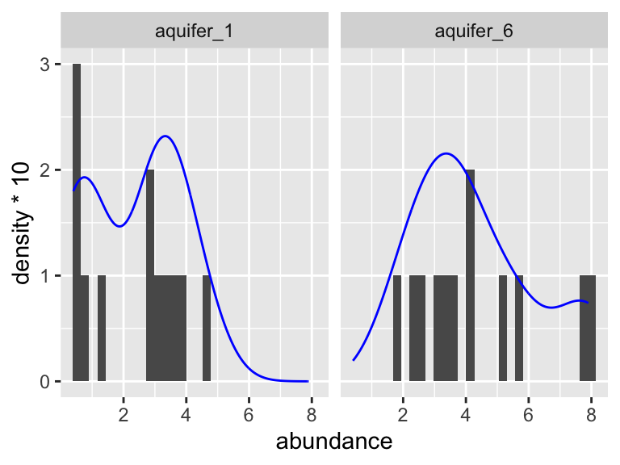

Based on this graphic, it's hard to say! Let's use a statistical test to help. When we want to run the Shaprio test, we are looking to see if each group has normally distributed here (here group is "aquifer_code", i.e. aquifer_1 and aquifer_6). This means we need to `group_by(aquifer_code)` before we run the test:


```r
K_data_1_2 %>%
  group_by(aquifer_code) %>% 
  shapiroTest(abundance)
## # A tibble: 2 × 4
##   aquifer_code variable  statistic     p
##   <chr>        <chr>         <dbl> <dbl>
## 1 aquifer_1    abundance     0.885 0.102
## 2 aquifer_6    abundance     0.914 0.239
```

Both p-values are above 0.05! This means that the distributions are not significantly different from a normal distribution. What about the variances about the two means? Are they similar? For this we need a Levene test. With that test, we are not looking within each group, but rather across groups - this means we do NOT need to `group_by(aquifer_code)` and should specify a `y ~ x` formula instead:


```r
K_data_1_2 %>%
  leveneTest(abundance ~ aquifer_code)
## # A tibble: 1 × 4
##     df1   df2 statistic     p
##   <int> <int>     <dbl> <dbl>
## 1     1    22     0.289 0.596
```

The p-value from this test is 0.596! This means that their variances are not significantly different.

## two means {-}

Now, since our data passed both test, this means we can use a normal t-test. A t-test is a parametric test. This means that it relies on modelling the data using a normal distribution in order to make comparisons. It is also a powerful test. This means that it is likely to detect a difference in means, assuming one is present. Let's try it out:


```r
K_data_1_2 %>%
  tTest(abundance ~ aquifer_code)
## # A tibble: 1 × 8
##   .y.       group1 group2    n1    n2 statistic    df      p
## * <chr>     <chr>  <chr>  <int> <int>     <dbl> <dbl>  <dbl>
## 1 abundance aquif… aquif…    12    12     -2.75  20.5 0.0121
```

A p-value of 0.012! This is below 0.05, meaning that there is a 95% chance that the two means are different. Suppose that our data had not passed the Shapiro and/or Levene tests. We would then need to use a Wilcox test. The Wilcox test is a non-parametric test, which means that it does not use a normal distribution to model the data in order to make comparisons. This means that is a less powerful test than the t-test, which means that it is less likely to detect a difference in the means, assuming there is one. For fun, let's try that one out and compare the p-values from the two methods:


```r
K_data_1_2 %>%
  wilcox_test(abundance ~ aquifer_code)
## # A tibble: 1 × 7
##   .y.       group1    group2       n1    n2 statistic      p
## * <chr>     <chr>     <chr>     <int> <int>     <dbl>  <dbl>
## 1 abundance aquifer_1 aquifer_6    12    12      33.5 0.0282
```

A p-value of 0.028! This is higher than the value given by the t-test (0.012). That is because the Wilcox test is a less powerful test: it is less likely to detect differences in means, assuming they exist.

## more than two means {-}

In the previous section we compared two means. What if we want to compare means from more than two study subjects? The first step is again to determine which tests to use. Let's consider our hawaii aquifer data again, though this time let's use all the aquifers, not just two:


```r
K_data <- hawaii_aquifers %>%
  filter(analyte == "K")

K_data
## # A tibble: 106 × 6
##    aquifer_code well_name         longitude latitude analyte
##    <chr>        <chr>                 <dbl>    <dbl> <chr>  
##  1 aquifer_1    Alewa_Heights_Sp…       NA      NA   K      
##  2 aquifer_1    Beretania_High_S…       NA      NA   K      
##  3 aquifer_1    Beretania_Low_Se…       NA      NA   K      
##  4 aquifer_1    Kuliouou_Well         -158.     21.3 K      
##  5 aquifer_1    Manoa_Well_II         -158.     21.3 K      
##  6 aquifer_1    Moanalua_Wells_P…     -158.     21.4 K      
##  7 aquifer_1    Moanalua_Wells_P…     -158.     21.4 K      
##  8 aquifer_1    Moanalua_Wells_P…     -158.     21.4 K      
##  9 aquifer_1    Nuuanu_Aerator_W…     -158.     21.4 K      
## 10 aquifer_1    Palolo_Tunnel         -158.     21.3 K      
## # … with 96 more rows, and 1 more variable: abundance <dbl>

ggplot(data = K_data, aes(y = aquifer_code, x = abundance)) +
  geom_boxplot() +
  geom_point(color = "maroon", alpha = 0.6, size = 3)
```


Let's check visually to see if each group is normally distributed and to see if they have roughly equal variance:


```r
K_data %>%
  group_by(aquifer_code) %>%
  ggplot(aes(x = abundance)) + 
    geom_histogram(bins = 30) +
    facet_wrap(~aquifer_code) +
    geom_density(aes(y = ..density..*10), colour = "blue")
```


Again, it is somewhat hard to tell visually if these data are normally distributed. It seems pretty likely that they have different variances about the means, but let's check using the Shapiro and Levene tests. Don't forget: with the Shaprio test, we are looking within each group and so need to `group_by()`, with the Levene test, we are looking across groups, and so need to provide a `y~x` formula:


```r
K_data %>%
  group_by(aquifer_code) %>% 
  shapiroTest(abundance)
## # A tibble: 10 × 4
##    aquifer_code variable  statistic         p
##    <chr>        <chr>         <dbl>     <dbl>
##  1 aquifer_1    abundance     0.885 0.102    
##  2 aquifer_10   abundance     0.864 0.163    
##  3 aquifer_2    abundance     0.913 0.459    
##  4 aquifer_3    abundance     0.893 0.363    
##  5 aquifer_4    abundance     0.948 0.421    
##  6 aquifer_5    abundance     0.993 0.972    
##  7 aquifer_6    abundance     0.914 0.239    
##  8 aquifer_7    abundance     0.915 0.355    
##  9 aquifer_8    abundance     0.842 0.220    
## 10 aquifer_9    abundance     0.790 0.0000214
```


```r
K_data %>%
  leveneTest(abundance ~ aquifer_code)
## # A tibble: 1 × 4
##     df1   df2 statistic       p
##   <int> <int>     <dbl>   <dbl>
## 1     9    96      2.95 0.00387
```

Based on these tests, it looks like the data for aquifer 9 is significantly different from a normal distribution (Shaprio test p = 0.000008), and the variances are certainly different from one another (Levene test p = 0.002).

Let's assume for a second that our data passed these tests. This means that we could reasonably model our data with normal distributions and use a parametric test to compare means. This means that we can use an ANOVA to test for differences in means.

### ANOVA, Tukey tests {-}

We will use the `anovaTest` function from the package `rstatix`. It will tell us if any of the means in the data are statistically different from one another. However, if there are differences between the means, it will not tell us which of them are different.


```r
K_data %>%
  anovaTest(abundance ~ aquifer_code)
## Coefficient covariances computed by hccm()
## ANOVA Table (type II tests)
## 
##         Effect DFn DFd     F        p p<.05   ges
## 1 aquifer_code   9  96 9.486 3.28e-10     * 0.471
```

A p-value of 7.7e-11! There are definitely some significant differences among this group. But, WHICH are different from one another though? For this, we need to run Tukey's Honest Significant Difference test (implemented using `tukeyHSD`). This will essentially run t-test on all the pairs of study subjects that we can derive from our data set (in this example, aquifer_1 vs. aquifer_2, aquifer_1 vs. aquifer_3, etc.). After that, it will correct the p-values according to the number of comparisons that it performed. This controls the rate of type I error that we can expect from the test. These corrected values are provided to us in the `p.adj` column.


