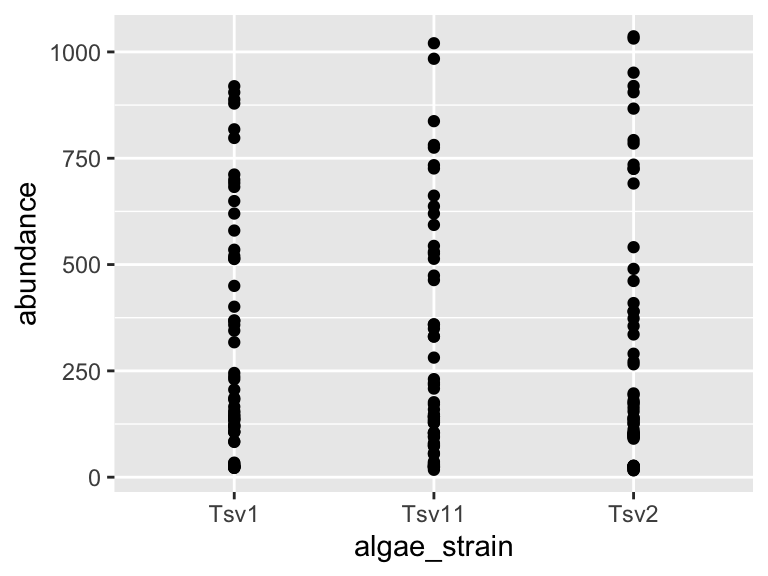
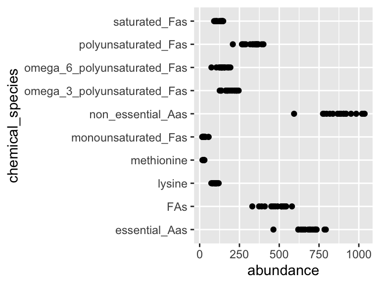
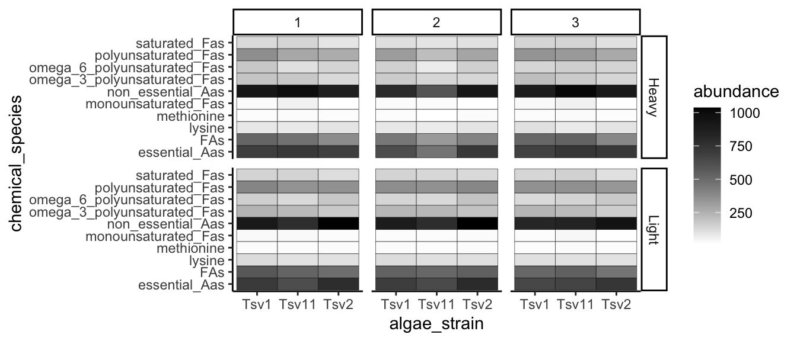
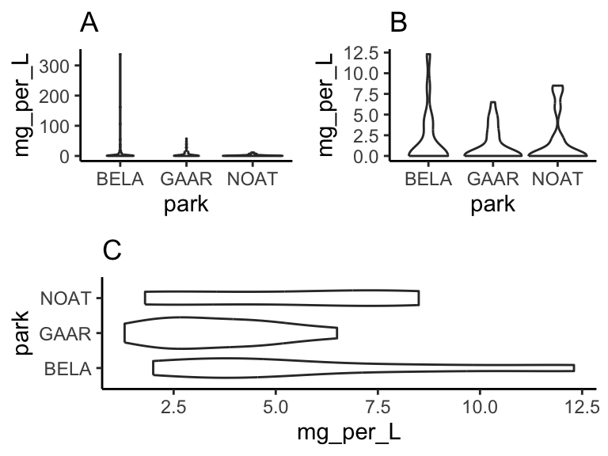
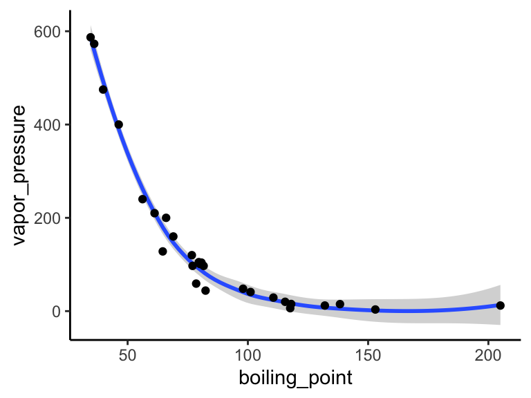
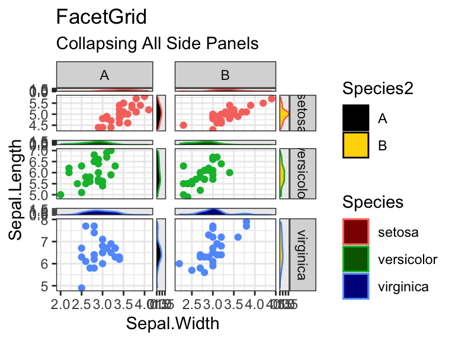

--- 
title: "Integrated Bioanalytics"
author: "Lucas Busta and members of the Busta lab"
date: "2023-06-16"
site: bookdown::bookdown_site
documentclass: krantz
bibliography: [book.bib, packages.bib]
# url: your book url like https://bookdown.org/yihui/bookdown
# cover-image: path to the social sharing image like images/cover.jpg
description: |
  Integrated Bioanalytics is a book describing how to perform chemical, phylogenetic, and genomic analyses.
biblio-style: apalike
csl: chicago-fullnote-bibliography.csl
output:
  bookdown::bs4_book:
    theme:
      primary: "#3860b6" #links  
      base_font: 
        google: 
          family: Lato
      heading_font:
        google:
          family: Montserrat
          wght: 600
      code_font:
        google: 
          family: Roboto Mono
      bg: "#fefefe" #backgrounds
      fg: "#000000" #fonts
    repo: 
      base: https://github.com/thebustalab/thebustalab.github.io/tree/master/integrated_bioanalytics
      branch: main
    includes:
      in_header: style/ga.html
    template: style/bs4_book.html
    css: style/style.css
---


# WELCOME {-}

<!-- start preface-->


Integrated Bioanalytics documents methods for analyzing chemical and sequence data in R as well as some basics of scientific writing. It is maintained by Lucas Busta and members of the Busta lab. To run the analyses described in this book you will need to run a source script that will set up your R environment with a variety of packages, custom functions, and data sets. If you don't have R, see "installation" under "Data Analysis In R" in the table of contents. Run the source script by pasting and executing the following in your R command line (RStudio recommended). If you are in the Busta Lab (or want access to full features), define an object `bustalab = TRUE` before running the source command. If you have trouble running the source script, please reach out to Lucas Busta at: bust0037@d.umn.edu. The source script: 


```r
source("https://thebustalab.github.io/phylochemistry/phylochemistry.R")
```

Features provided by the source script:

--Analysis and visualization tools--

* A GC-MS data analysis application with a MS reference library.
* A sequence alignment analysis application for trimming alignments.
* Functions for dimensionality reduction, clustering, modeling, and visualization.

--Useful data--

* More than 12 chemical data sets for running practice analyses.
* A phylogeny for >30,000 plant species, including nearly 30,000 angiosperms, >500 gymnosperms, nearly 500 pteridophytes, and 100 bryophytes (https://thebustalab.github.io/data/plant_phylogeny.newick).
* A list of nearly 400,000 plant species as well as the families, orders, and phyla to which they belong (https://thebustalab.github.io/data/plant_species.csv).

<!-- end -->

# (PART) DATA ANALYSIS IN R

<!-- start overview -->

# overview {-}


In bioanalytical science, we separate, identify, and quantify matter - be it DNA, RNA, proteins, small molecules, or even atoms. To connect our data with the world around us and answer scientific questions, multiple chemical entities must be separated, quantified, and identified. As our ability to collect analytical data expands, so must our ability to effectively analyze that data - whether it’s 10 data points or 10,000. In this chapter, we will explore, critique, and practice methods of handling and visualizing the data generated in large analytical projects. We'll also look at how to answer common quesions we may have about our data: "Which of my samples are most closely related?", "Which analytes are driving differences among my samples?", "Do my samples fall into definable clusters?", "Are any of my variables related?", and "Are any of these distributions different?".

<!-- end -->

<!-- start installation -->

# installation {-}


## R {-}

R is the computing language we will use to run our analyses and produce high quality plots. If you already have R installed (you will need at least version 4.1.1), you can go straight to installing RStudio. If not, follow these steps to install R:

1. Go to https://cran.r-project.org/

2. Click on "Download R for \<your operating system\>" (see footnote), depending on your operating system you will select "Download R for Linux", "Download R for (Mac) OS X", or "Download R for Windows".

We will use \<this notation\> quite a bit. It indicates a place where you should insert information, data, or something similar that corresponds to your particular situation. In this example it means insert "your operating system", i.e. Linux, (Mac) OS X, or Windows.

3. For Mac: download the .pkg file for the latest release. For PC: click "install R for the first time", then click "Download R \<version\> for Windows".

4. After the executable finishes downloading (in Windows, it is a file with .exe extension; for Mac, it is a .dmg file or a .dmg inside a .pkg file), open the file as an administrator, and follow the installation instructions. R should install without any problems. You can click OK for all of the windows that pop-up during installation, and choose a "regular" installation (if given the choice). 

If you have trouble installing R please google "Install R Mac" or "Install R PC" and follow one the many video tutorials out there. If you have tried this and are still having trouble, please contact me.

## RStudio {-}

Once we install R, we can install RStudio, which is essentially a convenient way of interacting with R. Some people do not like RStudio and prefer to interact with R directly. This is fine, but many beginning R users find RStudio helpful, so I recommend it. Follow these steps to install RStudio:

1. Go to https://rstudio.com/

2. Click "DOWNLOAD" at the top of the page.

3. Click the "DOWNLOAD" button that corresponds to RStudio Desktop with the free Open Source License.

4. The page may automatically detect which operating system you are using and recommend a version for you. If it does, download that file (.exe for PC or .dmg for Mac). If not, scroll down to the "All Installers" section and download the file that is right for you. Open the file as an administrator, and follow the installation instructions. RStudio should install without any problems. You can click OK for all of the windows that pop-up during installation, and choose a "regular" installation (if given the choice).

If you have trouble installing RStudio please google "Install RStudio Mac" or "Install RStudio PC" and following one the many video tutorials out there. If you have tried this and are still having trouble, please contact me.

## verification {-}

Open RStudio by clicking on the appropriate file in your applications folder, or wherever it is saved on your computer. If you are on Windows, be sure to run RStudio as administrator. You will see several windows. One is the Code Editor, one is the R Console, one is the Workspace and History, and one is the Plots and Files window.


The R Console window should have a `>` in it. Type `head(Indometh)`. This should display the first six lines of a data set describing the pharmacokinets of indomethacin. This is one of the built in datasets in R - you do not need any additional files to run this test.


```r
head(Indometh)
## Grouped Data: conc ~ time | Subject
##   Subject time conc
## 1       1 0.25 1.50
## 2       1 0.50 0.94
## 3       1 0.75 0.78
## 4       1 1.00 0.48
## 5       1 1.25 0.37
## 6       1 2.00 0.19
```

Next, type `plot(Indometh)` into the R Console. This will plot the indomethacin dataset in a basic way.


```r
plot(Indometh)
```


If both the above commands (`head(Indometh)` and `plot(Indometh)`) worked and there were no error messages during installation, then you should be ready to proceed.

<!-- ## tidyverse

For us to run our analyses, we need to install a set of add-on functions that expand R's capabilities. These functions are collected in something called the tidyverse, a very well-known and widely-used R package. You do not need to manually download anything to complete this installation - R will do it for you. In the R Console, type `install.packages("tidyverse", repos = "https://cran.us.r-project.org")` to install the tidyverse. Let's try it:

RSudio might ask you: "Do you want to install from sources the packages which need compilation? (Yes/no/cancel)", for now, type `no` and press enter.


```r
install.packages("tidyverse", repos = "https://cran.us.r-project.org")
```

Let's make sure your version of the tidyverse is installed correctly. To do this, we will load the `tidyverse` library/package inside of an R session. We can do this using `library(tidyverse)`. Let's try it:

```r
library(tidyverse)
```

If the library load correctly - then you are set to go! If not, try updating your R / RStudio installations, the re installing the tidyverse. If this still fails, please contact me. -->

## TeX {-}

In this class we will generate high quality reports suitable for submission to supervisors, academic journals, etc. For this, we need the typesetting engine TeX. There are a few ways to do this. The easiest way is using the following commands:


```r
install.packages(c('tinytex', 'rmarkdown'))
```

If you are on Mac, you may get an error about "not being able to write to a path" or something like that. In that case you probably need to open your terminal and run the following two commands: 

```
sudo chown -R \`whoami\`:admin /usr/local/bin
```

  and then 

```
~/Library/TinyTeX/bin/\*/tlmgr path add
```

Then, on both Mac and PC, you then need to do:

```r
tinytex::install_tinytex()
```

Other options are: if you have Windows, download and install [MikTeX](https://miktex.org/download). If you have OSX, you can download and install [MacTeX](https://www.tug.org/mactex/morepackages.html).

## phylochemistry {-}

In addition to the tidyverse, there are a variety of other packages we will need, as well as some datasets and custom functions. These call all be loaded by doing the following.

First, attempt to load phylochemistry, if you are on Windows, be sure you've opened RStudio as an administrator (right click, "run as administrator"):

```r
bustalab <- TRUE
source("https://thebustalab.github.io/phylochemistry/phylochemistry.R")
```

The first time you try this, it will very likely say: "You need to install the following packages before proceeding […] Is it okay if phylochemistry installs them for you?" You should say "yes".

<!-- Run: installPhylochemistry() to automatically install the required packages." -->

<!-- This means that some of the prerequisite packages that phylochemistry needs are not installed. If this happens, run the following: -->
<!-- ```{r, message = FALSE, eval = FALSE} -->
<!-- installPhylochemistry() -->
<!-- ``` -->
<!-- Sometimes when you run `installPhylochemistry()` you will get a message: -->

<!--   `Update all/some/none? [a/s/n]:` -->

<!--   In this case, it is generally advisable to enter `a` into the console and then press enter, indicating to R that you wish to update anything and everything that can be updated. -->

<!--   Other times you may get this message: -->

<!--   `Do you want to install from sources the packages which need compilation? (Yes/no/cancel)` -->

<!--   You can reply `yes` if you wish, but for simplicity's sake it is okay to say `no`. I usually start with saying `no`, only reverting to `yes` if things don't work down the line. -->

<!-- Once that is complete, and assuming no errors are displayed, attempt to load phylochemistry again: -->
<!-- ```{r, message = FALSE} -->
<!-- source("https://thebustalab.github.io/phylochemistry/phylochemistry.R") -->
<!-- ``` -->

## gptstudio {-}

First, install gptstudio using: `remotes::install_github("MichelNivard/gptstudio")`

Next, go to: https://openai.com/blog/openai-api and create an account and get an API key. Here are the steps:

- Visit the OpenAI website at https://openai.com/ and sign in to your account. If you don't have an account, you'll need to create one first.
- Once logged in you’ll need to click the option that brings you to the open AI API homepage (not the chatGPT homepage)
- Once on the open AI API homepage, click in the top right corner of your screen where it says “personal” and select “view API keys”
- Click the button that says “create new secret key” to create a new API key.

Do not share you API key with others!

Then, in RStudio, run:


```r
Sys.setenv(OPENAI_API_KEY = "<insert_your_api_key_here>")
```

This will enable an add in that you can access by clicking: Addins > GPTStudio. It has four major functions that can help you with spelling and grammar, commenting your code, and writing code. Please see the examples here: https://github.com/MichelNivard/gptstudio.

For further ideas on how to use GPT: https://github.com/dsdanielpark/amazing-bard-prompts/blob/main/bard_prompts/bard_prompts_english.csv

## Updating R and R Packages {-}

Close RStudio, open the plain R GUI, then run the following:

On Mac:


```r
install.packages('remotes') #assuming it is not remotes installed
remotes::install_github('andreacirilloac/updateR')
updateR::updateR()
```

On PC:


```r
install.packages("installr")
installr::updateR()
```

## R scripts on Google Drive {-}

Sometimes we want to save our R scripts on Google Drive. If you have an R script on Google Drive and want to open it in RStudio, get the share link for the file and use the following command:

```r
openRGD("file_share_link_here")
```

When you do this, "IN_USE___" will appear in front of the file name in Google Drive, so that others will know that you are using it. When you are done using the file, you can save and close it using:

```r
closeRGD("file_share_link_here")
```

<!-- end -->

<!-- start data visualization -->

# data visualization {-}


Visualization is one of the most fun parts of working with data. In this section, we will jump into visualization as quickly as possible - after just a few prerequisites. Please note that data visualization is a whole field in and of itself (just google "data visualization" and see what happens). Data visualization is also rife with "trendy" visuals, misleading visuals, and visuals that look cool but don't actually communicate much information. We will touch on these topics briefly, but will spend most of our time practicing how to represent our data in intuitive and interpretable ways. Let's get started!

## {-}

## objects {-}

In R, data is stored in objects. You can think of objects as if they were "files" inside an R session. `phylochemistry` provides a variety of objects for us to work with. Let's look at how to create an object. For this, we can use an arrow: `<-` . The arrow will take something and store it inside an object. For example:


```r
new_object <- 1
```

Now we've got a new object called `new_object`, and inside of it is the number 1. To look at what's inside an object, we can simply type the name of the object into the console:


```r
new_object 
## [1] 1
```

Easy! Let's look at one of the objects that comes with our class code base. What are the dimensions of the "algae_data" data set?


```r
algae_data
## # A tibble: 180 × 5
##    replicate algae_strain harvesting_regime chemical_species
##        <dbl> <chr>        <chr>             <chr>           
##  1         1 Tsv1         Heavy             FAs             
##  2         1 Tsv1         Heavy             saturated_Fas   
##  3         1 Tsv1         Heavy             omega_3_polyuns…
##  4         1 Tsv1         Heavy             monounsaturated…
##  5         1 Tsv1         Heavy             polyunsaturated…
##  6         1 Tsv1         Heavy             omega_6_polyuns…
##  7         1 Tsv1         Heavy             lysine          
##  8         1 Tsv1         Heavy             methionine      
##  9         1 Tsv1         Heavy             essential_Aas   
## 10         1 Tsv1         Heavy             non_essential_A…
## # ℹ 170 more rows
## # ℹ 1 more variable: abundance <dbl>
```

## functions {-}

Excellent - we've got data. Now we need to manipulate it. For this we need functions:

* A function is a command that tells R to perform an action!
* A function begins and ends with parentheses: `this_is_a_function()`
* The stuff inside the parentheses are the details of how you want the function to perform its action: `run_this_analysis(on_this_data)`

Let's illustrate this with an example. `algae_data` is a pretty big object. For our next chapter on visualization, it would be nice to have a smaller dataset object to work with. Let's use another `tidyverse` command called `filter` to filter the `algae_data` object. We will need to tell the filter command what to filter out using "logical predicates" (things like equal to: `==`, less than: `<`, greater than: `>`, greater-than-or-equal-to: `<=`, etc.). Let's filter `algae_data` so that only rows where the `chemical_species` is equal to `FAs` (fatty acids) is preserved. This will look like `chemical_species == "FAs"`. Here we go:


```r
filter(algae_data, chemical_species == "FAs")
## # A tibble: 18 × 5
##    replicate algae_strain harvesting_regime chemical_species
##        <dbl> <chr>        <chr>             <chr>           
##  1         1 Tsv1         Heavy             FAs             
##  2         2 Tsv1         Heavy             FAs             
##  3         3 Tsv1         Heavy             FAs             
##  4         1 Tsv1         Light             FAs             
##  5         2 Tsv1         Light             FAs             
##  6         3 Tsv1         Light             FAs             
##  7         1 Tsv2         Heavy             FAs             
##  8         2 Tsv2         Heavy             FAs             
##  9         3 Tsv2         Heavy             FAs             
## 10         1 Tsv2         Light             FAs             
## 11         2 Tsv2         Light             FAs             
## 12         3 Tsv2         Light             FAs             
## 13         1 Tsv11        Heavy             FAs             
## 14         2 Tsv11        Heavy             FAs             
## 15         3 Tsv11        Heavy             FAs             
## 16         1 Tsv11        Light             FAs             
## 17         2 Tsv11        Light             FAs             
## 18         3 Tsv11        Light             FAs             
## # ℹ 1 more variable: abundance <dbl>
```

Cool! Now it's just showing us the 18 rows where the chemical_species is fatty acids (FAs). Let's write this new, smaller dataset into a new object. For that we use `<-`, remember?


```r
algae_data_small <- filter(algae_data, chemical_species == "FAs")
algae_data_small
## # A tibble: 18 × 5
##    replicate algae_strain harvesting_regime chemical_species
##        <dbl> <chr>        <chr>             <chr>           
##  1         1 Tsv1         Heavy             FAs             
##  2         2 Tsv1         Heavy             FAs             
##  3         3 Tsv1         Heavy             FAs             
##  4         1 Tsv1         Light             FAs             
##  5         2 Tsv1         Light             FAs             
##  6         3 Tsv1         Light             FAs             
##  7         1 Tsv2         Heavy             FAs             
##  8         2 Tsv2         Heavy             FAs             
##  9         3 Tsv2         Heavy             FAs             
## 10         1 Tsv2         Light             FAs             
## 11         2 Tsv2         Light             FAs             
## 12         3 Tsv2         Light             FAs             
## 13         1 Tsv11        Heavy             FAs             
## 14         2 Tsv11        Heavy             FAs             
## 15         3 Tsv11        Heavy             FAs             
## 16         1 Tsv11        Light             FAs             
## 17         2 Tsv11        Light             FAs             
## 18         3 Tsv11        Light             FAs             
## # ℹ 1 more variable: abundance <dbl>
```

## ggplot & geoms {-}

Now we have a nice, small table that we can use to practice data visualization. For visualization, we're going to use `ggplot2` - a powerful set of commands for plot generation. 


There are three steps to setting up a ggplot:

1. **Define the data you want to use.**

We do this using the ggplot function's data argument. When we run that line, it just shows a grey plot space. Why is this? It's because all we've done is told ggplot that (i) we want to make a plot and (ii) what data should be used. We haven't explained how to represent features of the data using ink.


```r
ggplot(data = algae_data_small)
```


2. **Define how your variables map onto the axes.**

This is called aesthetic mapping and is done with the `aes()` function. `aes()` should be placed inside the `ggplot` command. Now when we run it, we get our axes!


```r
ggplot(data = algae_data_small, aes(x = algae_strain, y = abundance))
```


3. **Use geometric shapes to represent other variables in your data.**

Map your variables onto the geometric features of the shapes. To define which shape should be used, use a `geom_*` command. Some options are, for example, `geom_point()`, `geom_boxplot()`, and `geom_violin()`. These functions should be added to your plot using the `+` sign. We can use a new line to keep the code from getting too wide, just make sure the `+` sign is at the end fo the top line. Let's try it:


```r
ggplot(data = algae_data_small, aes(x = algae_strain, y = abundance)) +
  geom_point()
```


In the same way that we mapped variables in our dataset to the plot axes, we can map variables in the dataset to the geometric features of the shapes we are using to represent our data. For this, again, use `aes()` to map your variables onto the geometric features of the shapes:


```r
ggplot(data = algae_data_small, aes(x = algae_strain, y = abundance)) + 
  geom_point(aes(color = harvesting_regime))
```


In the plot above, the points are a bit small, how could we fix that? We can modify the features of the shapes by adding additional arguments to the `geom_*()` functions. To change the size of the points created by the `geom_point()` function, this means that we need to add the `size = ` argument. IMPORTANT! Please note that when we map a feature of a shape to a *variable* in our data(as we did with color/harvesting regime, above) then it goes *inside* aes(). In contrast, when we map a feature of a shape to a *constant*, it goes *outside* aes(). Here's an example:


```r
ggplot(data = algae_data_small, aes(x = algae_strain, y = abundance)) + 
  geom_point(aes(color = harvesting_regime), size = 5)
```


One powerful aspect of `ggplot` is the ability to quickly change mappings to see if alternative plots are more effective at bringing out the trends in the data. For example, we could modify the plot above by switching how harvesting_regime is mapped:


```r
ggplot(data = algae_data_small, aes(x = algae_strain, y = abundance)) +
  geom_point(aes(size = harvesting_regime), color = "black")
```


** Important note: Inside the `aes()` function, map aesthetics (the features of the geom's shape) to a *variable*. Outside the `aes()` function, map aesthetics to *constants*. You can see this in the above two plots - in the first one, color is inside `aes()` and mapped to the variable called harvesting_regime, while size is outside the `aes()` call and is set to the constant 5. In the second plot, the situation is reversed, with size being inside the `aes()` function and mapped to the variable harvesting_regime, while color is outside the `aes()` call and is mapped to the constant "black".

We can also stack geoms on top of one another by using multiple `+` signs. We also don't have to assign the same mappings to each geom.


```r
ggplot(data = algae_data_small, aes(x = algae_strain, y = abundance)) + 
  geom_violin() +
  geom_point(aes(color = harvesting_regime), size = 5)
```


As you can probably guess right now, there are lots of mappings that can be done, and lots of different ways to look at the same data!


```r
ggplot(data = algae_data_small, aes(x = algae_strain, y = abundance)) +
  geom_violin(aes(fill = algae_strain)) +
  geom_point(aes(color = harvesting_regime, size = replicate))
```




```r
ggplot(data = algae_data_small, aes(x = algae_strain, y = abundance)) +
  geom_boxplot()
```



## markdown {-}

Now that we are able to filter our data and make plots, we are ready to make reports to show others the data processing and visualization that we are doing. For this, we will use R Markdown. You can open a new markdown document in RStudio by clicking: `File -> New File -> R Markdown`. You should get a template document that compiles when you press "knit".

Customize this document by modifying the title, and add `author: "your_name"` to the header. Delete all the content below the header, then compile again. You should get a page that is blank except for the title and the author name.

You can think of your markdown document as a stand-alone R Session. This means you will need to load our class code base into each new markdown doument you create. You can do this by adding a "chunk" or R code. That looks like this:


You can compilie this document into a pdf. We can also run R chunks right inside the document and create figures. You should notice a few things when you compile this document:

1. Headings: When you compile that code, the "# My first analysis" creates a header. You can create headers of various levels by increasing the number of hashtags you use in front of the header. For example, "## Part 1" will create a subheading, "### Part 1.1" will create a sub-subheading, and so on.

2. Plain text: Plain text in an R Markdown document creates a plan text entry in your compiled document. You can use this to explain your analyses and your figures, etc.

3. You can modify the output of a code chunk by adding arguments to its header. Useful arguments are fig.height, fig.width, and fig.cap. Dr. Busta will show you how to do this in class.

## exercises I {-}

In this set of exercises we're going to practice filtering and plotting data in R Markdown. We're going to work with two datasets: (i) algae_data and (ii) alaska_lake_data. **For these exercises, you will write your code and answers to all questions in an R Markdown report, compile it as a pdf, and submit it on Canvas. If you have any questions please let me know**

Some pointers:

- If your code goes off the page, don't be afraid to wrap it across multiple lines, as shown in some of the examples.

- Don't be afraid to put the variable with the long elements / long text on the y-axis and the continuous variable on the x-axis.

### algae {-}

1. You will have `algae_data` stored in an object called `algae_data` as soon as you run `source("https://thebustalab.github.io/phylochemistry/phylochemistry.R")`. For this question, filter the data so that only entries are shown for which the `chemical_species` is "FAs" (remember that quotes are needed around FAs here!). What are the dimensions (i.e. number of rows and columns) of the resulting dataset?


2. Now filter the dataset so that only entries for the `algae_strain` "Tsv1" are shown. What are the dimensions of the resulting dataset?


3. Now filter the dataset so that only entries with an abundance greater than 250 are shown. Note that `>` can be used in the filter command instead of `==`, and that numbers inside a filter command do not require quotes around them. What are the dimensions of the resulting dataset?


4. Make a ggplot that has `algae_strain` on the x axis and `abundance` on the y axis. Remember about `aes()`. Use points (`geom_point()`) to represent each compound. You don't need to color the points. Which algae strain has the most abundant compound out of all the compounds in the dataset?


5. Make a ggplot that has `abundance` on the x axis and `chemical_species` on the y axis. Use points to represent each compound. You don't need to color the points. Generally speaking, what are the two most abundant classes of chemical species in these algae strains? (FAs/Fas stand for fatty acids, AAs/Aas stand for amino acids.)


6. I am going to show you an example of how you can filter and plot at the same time. To do this, we nest the filter command inside ggplot's data argument:


```r
ggplot(
  data = filter(algae_data, chemical_species == "essential_Aas"),
  aes(x = algae_strain, y = abundance)) +
geom_point()
```


Using the above as a template, make a plot that shows just `omega_3_polyunsaturated_Fas`, with algae_strain on the x axis, and abundance on the y axis. Color the points so that they correspond to `harvesting_regime`. Remember that mapping a feature of a shape onto a variable must be done inside `aes()`. Change the plot so that all the points are size = 5. Remember that mapping features of a shape to a constant needs to be done outside `aes()`. Which harvesting regime leads to higher levels of `omega_3_polyunsaturated_Fas`?


7. Use a combination of filtering and plotting to show the abundance of the different chemical species in just the `algae_strain` called "Tsv1". Use an x and y axis, as well as points to represent the measurements. Make point size correspond to the replicate, and color the points according to harvesting regime.


8. Make a plot that checks to see which `chemical_species` were more abundant under light as opposed to heavy `harvesting_regime` in all three replicates. Use filtered data so that just one `algae_strain` is shown, an x and a y axis, and points to represent the measurements. Make the points `size = 5` and also set the point's `alpha = 0.6`. The points should be colored according to harvesting_regime. Make 3 plots, one for each strain of algae.


9. Take the code that you made for the question above. Remove the filtering. Add the following line to the end of the plot: `facet_grid(.~algae_strain)`. Remember that adding things to plots is done with the `+` sign, so your code should look something like:


```r
ggplot(data = algae_data, aes(x = <something>, y = <something else>)) +
  geom_point(aes(<some things>), <some here too>) +
  facet_grid(.~algae_strain)
```


Also try, instead of `facet_grid(.~algae_strain)`, `facet_grid(algae_strain~.)` at the end of you plot command. (note the swap in the position of the `.~` relative to `algae_strain`). This means your code should look something like:


```r
ggplot(data = algae_data, aes(x = <something>, y = <something else>)) +
  geom_point(aes(<some things>), <some here too>) +
  facet_grid(algae_strain~.)
```


What advantages does this one extra line (i.e. facet_grid) provide over what you had to do in question 8?

### alaska lakes {-}

1. Use R to view the first few lines of the `alaska_lake_data` dataset. Do your best to describe, in written format, the kind of data that are in this data set.


2. How many variables are in the Alaska lakes dataset?


3. Filter the data set so only meausurements of free elements (i.e. element_type is "free") are shown. Remember, it's `==`, not `=`. What are the dimensions of the resulting dataset?


4. Make a plot that shows the water temperatures of each lake. Don't worry if you get a warning message from R about "missing values". Which is the hottest lake? The coolest?


5. Make a plot that shows the water temperature of each lake. The x axis should be `park`, the y axis `water temp`. Add geom_violin() to the plot first, then geom_point(). Make the points size = 5. Color the points according to water_temp. Which park has four lakes with very similar temperatures?


6. From the plot you made for question 5, it should be apparent that there is one lake in NOAT that is much warmer than the others. Filter the data so that only entries from `park == "NOAT"` are shown (note the double equals sign and the quotes around NOAT...). Combine this filtering with plotting and use geom_point() to make a plot that shows which specific lake that is.


7. Make a plot that shows which lake has the highest abundance of sulfur.


8. Make a plot that uses geom_point(). Set the "shape" aesthetic of the points to 21, i.e. `geom_point(aes(...), shape = 21)`. This gives you access to a new aesthetics: `fill`. It also changes the behaviour of the `color` aesthetic slightly, in that it now controls border color, not the internal color. Here is an example (though it doesn't make a very nice plot):


```r
ggplot(
  data = filter(alaska_lake_data, lake == "Lake_Narvakrak"),
  aes(x = lake, y = mg_per_L)
) +
  geom_point(
    shape = 21, size = 10,
    color = "black", fill = "green"
  )
```


Now we have lots of aesthetics we can map to: x, y, size, color, and fill (leave shape set to 21 for now). Make a plot of your own design. It should include filtering, and all the aesthetics listed above, though whether you map them to a variable or a constant is up to you.


When you are done with this plot, take a screen shot of it. Go to [THIS GOOGLE SHEET](https://docs.google.com/presentation/d/1G0BJ_qye9a_HAPLktFytj66qSj20BjoUOTKtjmCyuN0/edit?usp=sharing), make a slide for yourself (you don't have to include your name), and paste your screen shot there. Add a small caption that explains how your variables are mapped.

## {-}

## more geoms {-}


We've looked at how to filter data and map variables in our data to geometric shapes to make plots. Let's have a look at a few more things. For these examples, we're going to use the data set called `solvents`. In these examples, I'd like to introduce you to two new geoms. The first `geom_smooth()` is used when there are two continuous variables. It is particularly nice when geom_point() is stacked on top of it.


```r
ggplot(data = solvents, aes(x = boiling_point, y = vapor_pressure)) + 
  geom_smooth() +
  geom_point()
## `geom_smooth()` using method = 'loess' and formula = 'y ~
## x'
```



Also, please be aware of `geom_tile()`, which is nice for situations with two discrete variables and one continuous variable. `geom_tile()` makes what are often referred to as heat maps. Note that `geom_tile()` is somewhat similar to `geom_point(shape = 21)`, in that it has both `fill` and `color` aesthetics that control the fill color and the border color, respectively.


```r
ggplot(
  data = filter(algae_data, harvesting_regime == "Heavy"),
  aes(x = algae_strain, y = chemical_species)
) + 
  geom_tile(aes(fill = abundance), color = "black", size = 1)
```


These examples should illustrate that there is, to some degree, correspondence between the type of data you are interested in plotting (number of discrete and continuous variables) and the types of geoms that can effectively be used to represent the data.


```r
i2 <- iris %>%
  mutate(Species2 = rep(c("A","B"), 75))
p <- ggplot(i2, aes(Sepal.Width, Sepal.Length, color = Species)) +
  geom_point()

p + geom_xsidedensity(aes(y=stat(density), xfill = Species), position = "stack")+
  geom_ysidedensity(aes(x=stat(density), yfill = Species2), position = "stack") +
  theme_bw() + 
  facet_grid(Species~Species2, space = "free", scales = "free") +
  labs(title = "FacetGrid", subtitle = "Collapsing All Side Panels") +
  ggside(collapse = "all") +
  scale_xfill_manual(values = c("darkred","darkgreen","darkblue")) +
  scale_yfill_manual(values = c("black","gold"))
```


There is a [handy cheat sheet](https://www.maths.usyd.edu.au/u/UG/SM/STAT3022/r/current/Misc/data-visualization-2.1.pdf) that can help you identify the right geom for your situation. Please keep this cheat sheet in mind for your future plotting needs...

You can also combine geoms to create more detailed representations of distributions:


```r
mpg %>% filter(cyl %in% c(4,6,8)) %>%
  ggplot(aes(x = factor(cyl), y = hwy, fill = factor(cyl))) +
  ggdist::stat_halfeye(
    adjust = 0.5, justification = -0.2, .width = 0, point_colour = NA
  ) +
  geom_boxplot(width = 0.12, outlier.color = NA, alpha = 0.5) +
  ggdist::stat_dots(side = "left", justification = 1.1, binwidth = .25)
```


## facets {-}

As alluded to in Exercises 1, it is possible to map variables in your dataset to more than the geometric features of shapes (i.e. geoms). One very common way of doing this is with facets. Faceting creates small multiples of your plot, each of which shows a different subset of your data based on a categorical variable of your choice. Let's check it out.

Here, we can facet in the horizontal direction:

```r
ggplot(data = algae_data, aes(x = algae_strain, y = chemical_species)) + 
  geom_tile(aes(fill = abundance), color = "black") + 
  facet_grid(.~replicate)
```


We can facet in the vertical direction:

```r
ggplot(data = algae_data, aes(x = algae_strain, y = chemical_species)) + 
  geom_tile(aes(fill = abundance), color = "black") + 
  facet_grid(replicate~.)
```


And we can do both at the same time:

```r
ggplot(data = algae_data, aes(x = algae_strain, y = chemical_species)) + 
  geom_tile(aes(fill = abundance), color = "black") + 
  facet_grid(harvesting_regime~replicate)
```


Faceting is a great way to describe more variation in your plot without having to make your geoms more complicated. For situations where you need to generate lots and lots of facets, consider `facet_wrap` instead of `facet_grid`:


```r
ggplot(data = algae_data, aes(x = replicate, y = algae_strain)) + 
  geom_tile(aes(fill = abundance), color = "black") + 
  facet_wrap(chemical_species~.)
```


<!-- HERE INTRODUCE COWPLOT!! -->


## scales {-}

Every time you define an aesthetic mapping (e.g. aes(x = algae_strain)), you are defining a new scale that is added to your plot. You can control these scales using the `scale_*` family of commands. Consider our faceting example above. In it, we use `geom_tile(aes(fill = abundance))` to map the abundance variable to the fill aesthetic of the tiles. This creates a scale called `fill` that we can adjust using `scale_fill_*`. In this case, fill is mapped to a continuous variable and so the fill scale is a color gradient. Therefore, `scale_fill_gradient()` is the command we need to change it. Remember that you could always type `?scale_fill_` into the console and it will help you find relevant help topics that will provide more detail. Another option is to google: "How to modify color scale ggplot geom_tile", which will undoubtedly turn up a wealth of help.


```r
ggplot(data = algae_data, aes(x = algae_strain, y = chemical_species)) + 
  geom_tile(aes(fill = abundance), color = "black") + 
  facet_grid(harvesting_regime~replicate) +
  scale_fill_gradient(low = "white", high = "black") +
  theme_classic()
```


One particularly useful type of scale are the color scales provided by RColorBrewer:


```r
display.brewer.all()
```



```r
ggplot(mtcars) +
  geom_point(
    aes(x = mpg, y = factor(cyl), fill = factor(carb)), 
    shape = 21, size = 6
  ) +
  scale_fill_brewer(palette = "Set1")
```


  
## themes {-}
  
So far we've just looked at how to control the means by which your *data* is represented on the plot. There are also components of the plot that are, strictly speaking, not *data* per se, but rather non-data ink. These are controlled using the `theme()` family of commands. There are two ways to go about this.

`ggplot` comes with a handful of built in "complete themes". These will change the appearance of your plots with respect to the non-data ink. Compare the following plots:


```r
ggplot(data = solvents, aes(x = boiling_point, y = vapor_pressure)) + 
  geom_smooth() +
  geom_point() +
  theme_classic()
## `geom_smooth()` using method = 'loess' and formula = 'y ~
## x'
```


```r
ggplot(data = solvents, aes(x = boiling_point, y = vapor_pressure)) + 
  geom_smooth() +
  geom_point() +
  theme_dark()
## `geom_smooth()` using method = 'loess' and formula = 'y ~
## x'
```


  

```r
ggplot(data = solvents, aes(x = boiling_point, y = vapor_pressure)) + 
  geom_smooth() +
  geom_point() +
  theme_void()
## `geom_smooth()` using method = 'loess' and formula = 'y ~
## x'
```



You can also change individual components of themes. This can be a bit tricky, but it's all explained if you run `?theme()`. Hare is an example (and google will provide many, many more).


```r
ggplot(data = solvents, aes(x = boiling_point, y = vapor_pressure)) + 
  geom_smooth() +
  geom_point() +
  theme(
    text = element_text(size = 20, color = "black")
  )
## `geom_smooth()` using method = 'loess' and formula = 'y ~
## x'
```


Last, here is an example of combining `scale_*` and `theme*` with previous commands to really get a plot looking sharp.


```r
ggplot(data = solvents, aes(x = boiling_point, y = vapor_pressure)) + 
  geom_smooth(color = "#4daf4a") +
  scale_x_continuous(
    name = "Boiling Point", breaks = seq(0,200,25), limits = c(30,210)
  ) +
  scale_y_continuous(
    name = "Vapor Pressure", breaks = seq(0,600,50)
  ) +
  geom_point(color = "#377eb8", size = 4, alpha = 0.6) +
  theme_bw() +
  theme(
    axis.text = element_text(color = "black"),
    text = element_text(size = 16, color = "black")
  )
## `geom_smooth()` using method = 'loess' and formula = 'y ~
## x'
```

<div class="figure" style="text-align: center">

<p class="caption">(\#fig:unnamed-chunk-75)Vapor pressure as a function of boiling point. A scatter plot with trendline showing the vapor pressure of thirty-two solvents (y-axis) a as a function of their boiling points (x-axis). Each point represents the boiling point and vapor pressure of one solvent. Data are from the 'solvents' dataset used in UMD CHEM5725.</p>
</div>

## subplots {-}

We can make subplots using the `patchwork` package, which comes with the `source()` command. Let's see:


